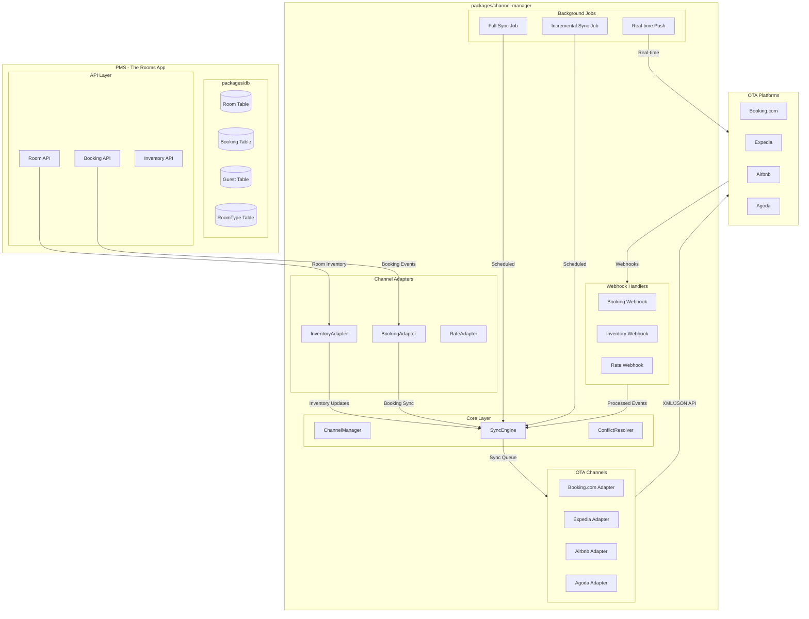

# Channel Manager Middleware - Technical Specification

## Executive Summary

This document outlines the technical architecture for a custom Channel Manager middleware for "The Rooms App" hotel management platform. The channel manager will enable bidirectional synchronization of inventory, rates, and bookings with Online Travel Agencies (OTAs) including Booking.com, Expedia, Airbnb, and Agoda.

---

## 1. Architecture Overview

### 1.1 Data Flow Diagram



### 1.2 Package Structure

```
packages/channel-manager/
├── package.json
├── tsconfig.json
├── src/
│   ├── index.ts                    # Package exports
│   │
│   ├── types/
│   │   ├── index.ts                # Core type definitions
│   │   ├── channel.ts             # Channel-specific types
│   │   ├── inventory.ts           # Inventory types
│   │   ├── booking.ts             # Booking sync types
│   │   └── webhook.ts             # Webhook payload types
│   │
│   ├── interfaces/
│   │   ├── IChannelAdapter.ts      # Base channel adapter interface
│   │   ├── IInventorySync.ts       # Inventory sync interface
│   │   ├── IBookingSync.ts        # Booking sync interface
│   │   ├── IRateSync.ts           # Rate sync interface
│   │   └── IWebhookHandler.ts     # Webhook handler interface
│   │
│   ├── core/
│   │   ├── ChannelManager.ts       # Main channel orchestration
│   │   ├── SyncEngine.ts          # Sync coordination engine
│   │   ├── ConflictResolver.ts    # Conflict resolution logic
│   │   ├── SyncScheduler.ts       # Job scheduling
│   │   └── ChannelRegistry.ts     # Channel registration
│   │
│   ├── adapters/
│   │   ├── BaseAdapter.ts         # Base adapter implementation
│   │   ├── BookingAdapter.ts      # Booking sync adapter
│   │   ├── InventoryAdapter.ts    # Inventory sync adapter
│   │   └── RateAdapter.ts         # Rate sync adapter
│   │
│   ├── channels/
│   │   ├── index.ts               # Channel exports
│   │   ├── booking-com.ts         # Booking.com adapter
│   │   ├── expedia.ts             # Expedia adapter
│   │   ├── airbnb.ts              # Airbnb adapter
│   │   └── agoda.ts               # Agoda adapter
│   │
│   ├── webhooks/
│   │   ├── index.ts               # Webhook exports
│   │   ├── WebhookRouter.ts       # Webhook routing
│   │   ├── BookingWebhookHandler.ts
│   │   ├── InventoryWebhookHandler.ts
│   │   └── RateWebhookHandler.ts
│   │
│   ├── jobs/
│   │   ├── FullSyncJob.ts         # Full inventory sync
│   │   ├── IncrementalSyncJob.ts  # Incremental sync
│   │   └── PushNotifier.ts        # Real-time push
│   │
│   ├── db/
│   │   ├── schema.prisma          # Channel manager schema
│   │   ├── queries/
│   │   │   ├── channelQueries.ts
│   │   │   ├── syncLogQueries.ts
│   │   │   └── mappingQueries.ts
│   │   └── mappers/
│   │       ├── BookingMapper.ts
│   │       ├── InventoryMapper.ts
│   │       └── RateMapper.ts
│   │
│   └── utils/
│       ├── logger.ts              # Logging utility
│       ├── retry.ts               # Retry with backoff
│       ├── signature.ts           # Webhook signature verification
│       └── xml-parser.ts         # XML parsing utilities
│
└── README.md
```

---

## 2. Database Schema Additions

### 2.1 Prisma Schema for Channel Management

```prisma
// ── Channel Configuration ─────────────────────────────────────────────────────

model Channel {
  id            String      @id @default(cuid())
  name          ChannelName @unique
  displayName   String
  logoUrl       String?
  isActive      Boolean     @default(false)
  config        Json?       // Encrypted credentials/secrets
  metadata      Json?       // Channel-specific settings
  
  // Rate plan and room type mappings
  roomMappings  RoomChannelMapping[]
  rateMappings  RateChannelMapping[]
  
  // Sync configuration
  syncSettings  ChannelSyncSettings?
  
  // Sync logs
  syncLogs      SyncLog[]
  
  createdAt     DateTime    @default(now())
  updatedAt     DateTime    @updatedAt

  @@map("channels")
}

enum ChannelName {
  BOOKING_COM
  EXPEDIA
  AIRBNB
  AGODA
}

// ── Room Mapping (PMS Room → OTA Room Type) ───────────────────────────────────

model RoomChannelMapping {
  id              String    @id @default(cuid())
  channelId       String
  channel         Channel   @relation(fields: [channelId], references: [id])
  
  // PMS side
  roomId          String
  roomType        RoomType
  
  // OTA side
  otaRoomTypeId   String    // Room type ID in OTA system
  otaRoomTypeName String?
  
  // Mapping metadata
  isActive        Boolean   @default(true)
  lastSyncedAt    DateTime?
  
  createdAt       DateTime  @default(now())
  updatedAt       DateTime  @updatedAt

  @@unique([channelId, roomId])
  @@map("room_channel_mappings")
}

// ── Rate Mapping (PMS Rate → OTA Rate Plan) ───────────────────────────────────

model RateChannelMapping {
  id              String    @id @default(cuid())
  channelId       String
  channel         Channel   @relation(fields: [channelId], references: [id])
  
  // PMS side
  rateType        RateType // SINGLE, DOUBLE, MONTHLY
  roomType        RoomType
  
  // OTA side
  otaRatePlanId   String
  otaRatePlanName String?
  
  // Rate settings
  isActive        Boolean   @default(true)
  lastSyncedAt    DateTime?
  
  createdAt       DateTime  @default(now())
  updatedAt       DateTime  @updatedAt

  @@unique([channelId, rateType, roomType])
  @@map("rate_channel_mappings")
}

enum RateType {
  SINGLE
  DOUBLE
  MONTHLY
}

// ── Channel Sync Settings ──────────────────────────────────────────────────────

model ChannelSyncSettings {
  id                    String    @id @default(cuid())
  channelId             String    @unique
  channel               Channel   @relation(fields: [channelId], references: [id])
  
  // Sync mode
  syncMode              SyncMode  @default(PUSH_BASED)
  
  // Sync schedules (cron expressions)
  fullSyncSchedule      String?   // e.g., "0 2 * * *" (2 AM daily)
  incrementalSyncSchedule String? // e.g., "*/15 * * * *" (every 15 min)
  
  // Sync preferences
  autoSyncInventory     Boolean   @default(true)
  autoSyncRates         Boolean   @default(true)
  autoImportBookings    Boolean   @default(true)
  
  // Conflict resolution
  conflictStrategy      ConflictStrategy @default(PMS_WINS)
  
  // Real-time push settings
  pushEnabled           Boolean   @default(false)
  pushEndpoint          String?   // Callback URL for push-based channels
  
  // Retry settings
  maxRetries            Int       @default(3)
  retryDelayMs          Int       @default(5000)
  
  createdAt             DateTime  @default(now())
  updatedAt             DateTime  @updatedAt

  @@map("channel_sync_settings")
}

enum SyncMode {
  PUSH_BASED        // PMS pushes updates to OTA
  PULL_BASED        // PMS pulls from OTA periodically
  WEBHOOK_BASED     // OTA pushes changes via webhooks
  HYBRID            // Combination of push/pull/webhook
}

enum ConflictStrategy {
  PMS_WINS          // PMS data takes precedence
  OTA_WINS          // OTA data takes precedence
  NEWEST_WINS       // Most recent update wins
  MANUAL            // Requires manual resolution
}

// ── Sync Log ───────────────────────────────────────────────────────────────────

model SyncLog {
  id              String      @id @default(cuid())
  channelId       String
  channel         Channel     @relation(fields: [channelId], references: [id])
  
  // Sync details
  syncType        SyncType
  syncDirection   SyncDirection
  status          SyncStatus @default(PENDING)
  
  // Data snapshot
  itemsTotal      Int         @default(0)
  itemsSynced     Int         @default(0)
  itemsFailed     Int         @default(0)
  
  // Error handling
  errorMessage    String?
  errorDetails    Json?
  
  // Timing
  startedAt       DateTime?
  completedAt     DateTime?
  durationMs      Int?
  
  // Request/Response for debugging
  requestPayload  Json?
  responsePayload Json?
  
  createdAt       DateTime    @default(now())

  @@index([channelId, status])
  @@index([channelId, createdAt])
  @@map("sync_logs")
}

enum SyncType {
  FULL_INVENTORY
  INCREMENTAL_INVENTORY
  RATE_UPDATE
  BOOKING_IMPORT
  BOOKING_UPDATE
  BOOKING_CANCEL
}

enum SyncDirection {
  OUTBOUND  // PMS → OTA
  INBOUND   // OTA → PMS
}

enum SyncStatus {
  PENDING
  IN_PROGRESS
  COMPLETED
  FAILED
  PARTIAL_FAILURE
}

// ── OTA Booking Mapping ────────────────────────────────────────────────────────

model OtaBookingMapping {
  id                  String    @id @default(cuid())
  
  // PMS booking
  bookingId           String    @unique
  bookingNumber       String
  
  // OTA booking
  channelId           String
  channelBookingId   String    // Booking ID in OTA system
  channelBookingRef  String?   // External reference
  
  // Status tracking
  lastSyncAt          DateTime
  syncStatus         OtaSyncStatus @default(SYNCED)
  
  createdAt           DateTime  @default(now())
  updatedAt           DateTime  @updatedAt

  @@index([channelId, channelBookingId])
  @@map("ota_booking_mappings")
}

enum OtaSyncStatus {
  SYNCED
  PENDING_UPDATE
  PENDING_CANCEL
  CONFLICT
  FAILED
}

// ── Webhook Log ───────────────────────────────────────────────────────────────

model WebhookLog {
  id              String      @id @default(cuid())
  channelId       String
  channelName     ChannelName
  
  // Webhook details
  webhookType     String      // "booking.created", "inventory.update", etc.
  eventId         String?     // External event ID
  
  // Payload
  rawPayload      Json
  parsedPayload   Json?
  
  // Processing
  status          WebhookStatus @default(RECEIVED)
  processedAt     DateTime?
  processingTimeMs Int?
  
  // Error handling
  errorMessage    String?
  
  // Response
  responseStatus  Int?
  responseBody    String?
  
  createdAt       DateTime    @default(now())

  @@index([channelId, status])
  @@index([createdAt])
  @@map("webhook_logs")
}

enum WebhookStatus {
  RECEIVED
  VALIDATED
  PROCESSING
  PROCESSED
  FAILED
}

// ── Inventory Snapshot (for conflict detection) ───────────────────────────────

model InventorySnapshot {
  id              String      @id @default(cuid())
  channelId       String
  roomId          String
  date            DateTime    @db.Date
  
  // Snapshot data
  availableRooms  Int
  totalRooms      Int
  rateSingle      Decimal?    @db.Decimal(10, 2)
  rateDouble      Decimal?    @db.Decimal(10, 2)
  rateMonthly     Decimal?    @db.Decimal(10, 2)
  
  // Source tracking
  source          String      // "PMS" or channel name
  version         Int         @default(1)
  
  createdAt       DateTime    @default(now())
  updatedAt       DateTime    @updatedAt

  @@unique([channelId, roomId, date])
  @@index([channelId, date])
  @@map("inventory_snapshots")
}
```

---

## 3. Core Interfaces and Abstractions

### 3.1 Channel Adapter Interface

```typescript
// packages/channel-manager/src/interfaces/IChannelAdapter.ts

import type { ChannelName, SyncType, SyncDirection } from '../types';

export interface ChannelConfig {
  apiKey?: string;
  apiSecret?: string;
  propertyId: string;
  hotelId?: string;           // OTA's hotel ID
  username?: string;
  password?: string;
  endpoint?: string;          // Custom API endpoint
  webhookSecret?: string;
}

export interface SyncResult {
  success: boolean;
  itemsSynced: number;
  itemsFailed: number;
  errors: SyncError[];
  durationMs: number;
  timestamp: Date;
}

export interface SyncError {
  itemId: string;
  itemType: 'room' | 'rate' | 'booking';
  errorCode: string;
  errorMessage: string;
  retryable: boolean;
}

export interface ChannelCapabilities {
  supportsRealTimePush: boolean;
  supportsRealTimePull: boolean;
  supportsWebhook: boolean;
  supportsXML: boolean;
  supportsJSON: boolean;
  maxBatchSize: number;
  rateLimitPerHour: number;
}

export interface IChannelAdapter {
  // Channel identification
  readonly channelName: ChannelName;
  readonly capabilities: ChannelCapabilities;
  
  // Configuration
  configure(config: ChannelConfig): void;
  validateConfig(): Promise<ValidationResult>;
  
  // Connection test
  ping(): Promise<boolean>;
  getHotelInfo(): Promise<HotelInfo>;
  
  // Inventory operations
  fetchInventory(startDate: Date, endDate: Date): Promise<InventoryUpdate[]>;
  pushInventory(inventory: InventoryUpdate[]): Promise<SyncResult>;
  
  // Rate operations
  fetchRates(startDate: Date, endDate: Date): Promise<RateUpdate[]>;
  pushRates(rates: RateUpdate[]): Promise<SyncResult>;
  
  // Booking operations
  fetchBookings(since: Date): Promise<OtaBooking[]>;
  pushBookingUpdate(booking: BookingUpdate): Promise<SyncResult>;
  pushBookingCancel(bookingId: string, reason: string): Promise<SyncResult>;
  
  // Webhook handling
  verifyWebhookSignature(payload: string, signature: string): boolean;
  parseWebhookPayload(payload: string): WebhookPayload;
}

export interface ValidationResult {
  valid: boolean;
  errors: string[];
  warnings: string[];
}

export interface HotelInfo {
  hotelId: string;
  name: string;
  address?: string;
  timezone: string;
  currency: string;
  roomCount: number;
}

export interface InventoryUpdate {
  roomId: string;
  otaRoomTypeId: string;
  date: Date;
  availableRooms: number;
  totalRooms: number;
  status: 'AVAILABLE' | 'SOLD_OUT' | 'ON_REQUEST';
}

export interface RateUpdate {
  roomId: string;
  otaRoomTypeId: string;
  otaRatePlanId: string;
  date: Date;
  rateSingle: number;
  rateDouble: number;
  rateMonthly?: number;
  currency: string;
  minStay: number;
  maxStay?: number;
  closedToArrival: boolean;
  closedToDeparture: boolean;
}

export interface OtaBooking {
  otaBookingId: string;
  otaReference?: string;
  guestName: string;
  guestEmail?: string;
  guestPhone: string;
  checkIn: Date;
  checkOut: Date;
  roomTypeId: string;
  roomTypeName: string;
  totalAmount: number;
  currency: string;
  status: 'CONFIRMED' | 'CANCELLED' | 'MODIFIED';
  specialRequests?: string;
  createdAt: Date;
  updatedAt: Date;
}

export interface BookingUpdate {
  pmsBookingId: string;
  otaBookingId: string;
  status: 'CONFIRMED' | 'CHECKED_IN' | 'CHECKED_OUT' | 'CANCELLED';
  checkIn?: Date;
  checkOut?: Date;
}

export interface WebhookPayload {
  eventType: string;
  eventId: string;
  timestamp: Date;
  data: Record<string, unknown>;
}
```

### 3.2 Inventory Sync Interface

```typescript
// packages/channel-manager/src/interfaces/IInventorySync.ts

import type { InventoryUpdate, SyncResult } from './IChannelAdapter';

export interface InventorySyncOptions {
  channelId: string;
  propertyId: string;
  startDate: Date;
  endDate: Date;
  syncType: 'FULL' | 'INCREMENTAL';
  forceOverwrite: boolean;
}

export interface InventoryConflict {
  roomId: string;
  date: Date;
  pmsValue: InventoryUpdate;
  otaValue: InventoryUpdate;
  resolution: 'PMS_WINS' | 'OTA_WINS' | 'NEWEST_WINS' | 'MANUAL';
  resolvedValue?: InventoryUpdate;
  resolvedAt?: Date;
  resolvedBy?: string;
}

export interface IInventorySync {
  // Sync operations
  syncInventory(options: InventorySyncOptions): Promise<SyncResult>;
  fetchFromPms(startDate: Date, endDate: Date): Promise<InventoryUpdate[]>;
  fetchFromChannel(channelId: string, startDate: Date, endDate: Date): Promise<InventoryUpdate[]>;
  
  // Conflict detection and resolution
  detectConflicts(pmsInventory: InventoryUpdate[], channelInventory: InventoryUpdate[]): InventoryConflict[];
  resolveConflicts(conflicts: InventoryConflict[]): Promise<InventoryConflict[]>;
  
  // Real-time updates
  pushRealtimeUpdate(roomId: string, update: InventoryUpdate): Promise<SyncResult>;
  
  // Mapping
  mapRoomToChannel(roomId: string, channelId: string): Promise<string | null>;
  mapChannelToRoom(otaRoomTypeId: string, channelId: string): Promise<string | null>;
}
```

### 3.3 Booking Sync Interface

```typescript
// packages/channel-manager/src/interfaces/IBookingSync.ts

import type { OtaBooking, BookingUpdate, SyncResult } from './IChannelAdapter';

export interface BookingSyncOptions {
  channelId: string;
  propertyId: string;
  since?: Date;              // For pull-based sync
  importNewBookings: boolean;
  updateExistingBookings: boolean;
  autoConfirm: boolean;     // Auto-confirm imported bookings
}

export interface BookingConflict {
  pmsBookingId?: string;
  otaBookingId: string;
  conflictType: 'DATE_MISMATCH' | 'ROOM_MISMATCH' | 'GUEST_MISMATCH' | 'PRICE_MISMATCH';
  pmsValue: Partial<OtaBooking>;
  otaValue: OtaBooking;
  resolution: 'PMS_WINS' | 'OTA_WINS' | 'MANUAL';
  resolvedBooking?: OtaBooking;
  resolvedAt?: Date;
}

export interface IBookingSync {
  // Sync operations
  importBookings(options: BookingSyncOptions): Promise<ImportResult>;
  exportBooking(bookingId: string, channelId: string): Promise<SyncResult>;
  updateBookingStatus(bookingId: string, status: string): Promise<SyncResult>;
  cancelBooking(bookingId: string, reason: string): Promise<SyncResult>;
  
  // Mapping
  getOtaBookingId(pmsBookingId: string): Promise<string | null>;
  getPmsBookingId(otaBookingId: string, channelId: string): Promise<string | null>;
  
  // Conflict handling
  detectConflicts(importedBookings: OtaBooking[]): BookingConflict[];
  resolveConflicts(conflicts: BookingConflict[]): Promise<BookingConflict[]>;
  
  // Guest creation
  createGuestFromOta(otaBooking: OtaBooking): Promise<string>; // Returns guest ID
}

export interface ImportResult {
  totalBookings: number;
  imported: number;
  updated: number;
  failed: number;
  conflicts: BookingConflict[];
  errors: { bookingId: string; error: string }[];
}
```

---

## 4. Sync Engine Architecture

### 4.1 Sync Engine Core

```typescript
// packages/channel-manager/src/core/SyncEngine.ts

export class SyncEngine {
  private registry: ChannelRegistry;
  private conflictResolver: ConflictResolver;
  private syncQueue: SyncQueue;
  
  // Sync methods
  async executeFullSync(channelId: string): Promise<SyncResult>;
  async executeIncrementalSync(channelId: string): Promise<SyncResult>;
  async executeRateSync(channelId: string): Promise<SyncResult>;
  
  // Parallel sync for multiple channels
  async syncAllChannels(syncType: 'FULL' | 'INCREMENTAL'): Promise<Map<string, SyncResult>>;
  
  // Booking sync
  async importBookingsFromChannel(channelId: string, since: Date): Promise<ImportResult>;
  async exportBookingToChannels(bookingId: string): Promise<Map<string, SyncResult>>;
  
  // Real-time push
  async pushInventoryUpdate(propertyId: string, roomId: string, update: InventoryUpdate): Promise<void>;
  async pushBookingUpdate(bookingId: string): Promise<void>;
}
```

### 4.2 Sync Scheduler

```typescript
// packages/channel-manager/src/core/SyncScheduler.ts

export class SyncScheduler {
  // Schedule full sync
  scheduleFullSync(channelId: string, cronExpression: string): void;
  
  // Schedule incremental sync
  scheduleIncrementalSync(channelId: string, cronExpression: string): void;
  
  // Cancel scheduled sync
  cancelSync(channelId: string, syncType: 'FULL' | 'INCREMENTAL'): void;
  
  // Manual trigger
  async triggerSync(channelId: string, syncType: SyncType): Promise<SyncResult>;
  
  // Status
  getSyncStatus(channelId: string): SyncStatus;
  getSyncHistory(channelId: string, limit: number): SyncLog[];
}
```

### 4.3 Conflict Resolution Strategy

```typescript
// packages/channel-manager/src/core/ConflictResolver.ts

export type ConflictType = 
  | 'INVENTORY_MISMATCH'
  | 'RATE_MISMATCH'
  | 'BOOKING_DATE_MISMATCH'
  | 'BOOKING_ROOM_MISMATCH'
  | 'BOOKING_STATUS_MISMATCH';

export interface Conflict<T> {
  id: string;
  type: ConflictType;
  channelId: string;
  pmsValue: T;
  otaValue: T;
  detectedAt: Date;
  resolution?: ConflictResolution;
}

export type ConflictResolution = 
  | { strategy: 'PMS_WINS'; resolvedAt: Date }
  | { strategy: 'OTA_WINS'; resolvedAt: Date }
  | { strategy: 'NEWEST_WINS'; resolvedAt: Date }
  | { strategy: 'MANUAL'; resolvedBy?: string; resolvedAt: Date; resolvedValue: T };

export class ConflictResolver {
  constructor(
    private defaultStrategy: ConflictStrategy,
    private channelStrategies: Map<string, ConflictStrategy>
  ) {}
  
  // Resolve inventory conflicts
  resolveInventoryConflict(conflict: Conflict<InventoryUpdate>): InventoryUpdate;
  
  // Resolve rate conflicts
  resolveRateConflict(conflict: Conflict<RateUpdate>): RateUpdate;
  
  // Resolve booking conflicts
  resolveBookingConflict(conflict: Conflict<OtaBooking>): OtaBooking | null; // null = requires manual
  
  // Apply resolution strategy
  private applyStrategy<T>(conflict: Conflict<T>, strategy: ConflictStrategy): T;
  
  // Detect conflicts
  detectInventoryConflicts(
    pmsInventory: InventoryUpdate[],
    channelInventory: InventoryUpdate[]
  ): Conflict<InventoryUpdate>[];
  
  detectBookingConflicts(
    pmsBooking: Booking | null,
    otaBooking: OtaBooking
  ): Conflict<OtaBooking>[];
}
```

---

## 5. Channel Adapter Implementations

### 5.1 Base Adapter

```typescript
// packages/channel-manager/src/adapters/BaseAdapter.ts

export abstract class BaseAdapter implements IChannelAdapter {
  protected config: ChannelConfig;
  
  abstract readonly channelName: ChannelName;
  abstract readonly capabilities: ChannelCapabilities;
  
  constructor(protected httpClient: HttpClient) {}
  
  configure(config: ChannelConfig): void {
    this.config = config;
  }
  
  async validateConfig(): Promise<ValidationResult> {
    const errors: string[] = [];
    const warnings: string[] = [];
    
    if (!this.config.propertyId) {
      errors.push('Property ID is required');
    }
    if (!this.config.apiKey && !this.config.username) {
      errors.push('API key or username is required');
    }
    
    return { valid: errors.length === 0, errors, warnings };
  }
  
  async ping(): Promise<boolean> {
    try {
      await this.getHotelInfo();
      return true;
    } catch {
      return false;
    }
  }
  
  protected async makeRequest<T>(
    method: 'GET' | 'POST' | 'PUT' | 'DELETE',
    endpoint: string,
    options?: RequestOptions
  ): Promise<T> {
    // Implement retry logic, auth headers, signature, etc.
  }
  
  protected signRequest(payload: string): string {
    // Override in subclasses for channel-specific signing
    return '';
  }
}
```

### 5.2 Booking.com Adapter (Priority 1)

```typescript
// packages/channel-manager/src/channels/booking-com.ts

/**
 * Booking.com Adapter Implementation
 * 
 * Booking.com uses:
 * - XML-based API for Availability and Booking updates
 * - JSON REST API for some operations
 * - Push notifications via callback URLs
 * 
 * Documentation: https://connect.booking.com/user_guide/
 */

export class BookingComAdapter extends BaseAdapter {
  readonly channelName = 'BOOKING_COM' as const;
  
  readonly capabilities: ChannelCapabilities = {
    supportsRealTimePush: true,
    supportsRealTimePull: true,
    supportsWebhook: true,
    supportsXML: true,
    supportsJSON: true,
    maxBatchSize: 1000,
    rateLimitPerHour: 5000,
  };
  
  // Booking.com specific methods
  async fetchInventory(startDate: Date, endDate: Date): Promise<InventoryUpdate[]> {
    const xml = this.buildAvailabilityRequest(startDate, endDate);
    const response = await this.makeRequest('POST', '/xml/availability', {
      body: xml,
      headers: { 'Content-Type': 'application/xml' }
    });
    return this.parseAvailabilityResponse(response);
  }
  
  async pushInventory(inventory: InventoryUpdate[]): Promise<SyncResult> {
    const xml = this.buildAvailabilityPush(inventory);
    const response = await this.makeRequest('POST', '/xml/availability', {
      body: xml,
      headers: { 'Content-Type': 'application/xml' }
    });
    return this.parseSyncResult(response);
  }
  
  async fetchBookings(since: Date): Promise<OtaBooking[]> {
    const response = await this.makeRequest('GET', `/json/reservations?since=${since.toISOString()}`);
    return this.parseReservationResponse(response);
  }
  
  verifyWebhookSignature(payload: string, signature: string): boolean {
    const expected = crypto
      .createHmac('sha256', this.config.webhookSecret!)
      .update(payload)
      .digest('base64');
    return timingSafeEqual(Buffer.from(signature), Buffer.from(expected));
  }
  
  parseWebhookPayload(payload: string): WebhookPayload {
    const data = JSON.parse(payload);
    return {
      eventType: data.event,
      eventId: data.id,
      timestamp: new Date(data.created),
      data: data.payload,
    };
  }
  
  // XML builders and parsers
  private buildAvailabilityRequest(startDate: Date, endDate: Date): string { /* ... */ }
  private parseAvailabilityResponse(xml: string): InventoryUpdate[] { /* ... */ }
  private buildAvailabilityPush(inventory: InventoryUpdate[]): string { /* ... */ }
  private parseReservationResponse(json: unknown): OtaBooking[] { /* ... */ }
}
```

### 5.3 Expedia Adapter (Priority 2)

```typescript
// packages/channel-manager/src/channels/expedia.ts

/**
 * Expedia PartnerCentral Adapter Implementation
 * 
 * Expedia uses:
 * - REST API with JSON payloads
 * - SOAP for some legacy operations
 * - ARNs (Arena Reservation Numbers) for bookings
 * 
 * Documentation: https://developers.expediagroup.com/
 */

export class ExpediaAdapter extends BaseAdapter {
  readonly channelName = 'EXPEDIA' as const;
  
  readonly capabilities: ChannelCapabilities = {
    supportsRealTimePush: true,
    supportsRealTimePull: true,
    supportsWebhook: true,
    supportsXML: false,
    supportsJSON: true,
    maxBatchSize: 500,
    rateLimitPerHour: 2000,
  };
  
  // Expedia specific methods
  async fetchInventory(startDate: Date, endDate: Date): Promise<InventoryUpdate[]> {
    const response = await this.makeRequest('GET', 
      `/properties/${this.config.hotelId}/availability`,
      { params: { startDate: formatDate(startDate), endDate: formatDate(endDate) } }
    );
    return this.parseAvailabilityResponse(response);
  }
  
  async pushRates(rates: RateUpdate[]): Promise<SyncResult> {
    const payload = this.buildRatesPayload(rates);
    const response = await this.makeRequest('PUT', 
      `/properties/${this.config.hotelId}/rates`,
      { body: JSON.stringify(payload) }
    );
    return this.parseSyncResult(response);
  }
  
  async fetchBookings(since: Date): Promise<OtaBooking[]> {
    const response = await this.makeRequest('GET',
      `/properties/${this.config.hotelId}/reservations`,
      { params: { createdDateStart: since.toISOString() } }
    );
    return this.parseReservationsResponse(response);
  }
}
```

### 5.4 Airbnb Adapter (Priority 3)

```typescript
// packages/channel-manager/src/channels/airbnb.ts

/**
 * Airbnb Adapter Implementation
 * 
 * Airbnb uses:
 * - JSON REST API via Partner API
 * - Webhook notifications for booking events
 * - Different availability model (calendar-based)
 * 
 * Documentation: https://www.airbnb.com/partner
 */

export class AirbnbAdapter extends BaseAdapter {
  readonly channelName = 'AIRBNB' as const;
  
  readonly capabilities: ChannelCapabilities = {
    supportsRealTimePush: true,
    supportsRealTimePull: true,
    supportsWebhook: true,
    supportsXML: false,
    supportsJSON: true,
    maxBatchSize: 30,  // Airbnb has smaller batch limits
    rateLimitPerHour: 500,
  };
  
  // Airbnb has a different availability model
  async fetchInventory(startDate: Date, endDate: Date): Promise<InventoryUpdate[]> {
    // Airbnb uses calendar-based availability
    const response = await this.makeRequest('GET', '/calendar', {
      params: { startDate, endDate }
    });
    return this.parseCalendarResponse(response);
  }
  
  async pushInventory(inventory: InventoryUpdate[]): Promise<SyncResult> {
    // Airbnb requires individual calendar updates
    return this.pushCalendarUpdates(inventory);
  }
}
```

### 5.5 Agoda Adapter (Priority 4)

```typescript
// packages/channel-manager/src/channels/agoda.ts

/**
 * Agoda Channel Adapter Implementation
 * 
 * Agoda uses:
 * - XML-based API for YCS (Yield Controlling System)
 * - CSV upload for bulk updates
 * - Different property ID format
 * 
 * Documentation: https://www.agoda.com/partner
 */

export class AgodaAdapter extends BaseAdapter {
  readonly channelName = 'AGODA' as const;
  
  readonly capabilities: ChannelCapabilities = {
    supportsRealTimePush: false,
    supportsRealTimePull: true,
    supportsWebhook: true,
    supportsXML: true,
    supportsJSON: false,
    maxBatchSize: 100,
    rateLimitPerHour: 1000,
  };
}
```

---

## 6. Webhook Handling Architecture

### 6.1 Webhook Router

```typescript
// packages/channel-manager/src/webhooks/WebhookRouter.ts

export class WebhookRouter {
  private handlers: Map<ChannelName, IWebhookHandler>;
  
  constructor(
    private syncEngine: SyncEngine,
    private logger: Logger
  ) {}
  
  // Register webhook handler for channel
  registerHandler(channel: ChannelName, handler: IWebhookHandler): void;
  
  // Route incoming webhook
  async route(
    channel: ChannelName,
    payload: string,
    signature: string,
    headers: Record<string, string>
  ): Promise<WebhookResponse> {
    const handler = this.handlers.get(channel);
    if (!handler) {
      throw new Error(`No handler registered for channel: ${channel}`);
    }
    
    // 1. Verify signature
    if (!handler.verifySignature(payload, signature)) {
      throw new WebhookError('INVALID_SIGNATURE', 'Webhook signature verification failed');
    }
    
    // 2. Parse payload
    const parsed = handler.parsePayload(payload);
    
    // 3. Log webhook
    const webhookLog = await this.logWebhook(channel, parsed);
    
    // 4. Process asynchronously
    this.processAsync(webhookLog.id, handler, parsed);
    
    // 5. Return immediate acknowledgment
    return { status: 'RECEIVED', webhookId: webhookLog.id };
  }
  
  private async processAsync(
    webhookLogId: string,
    handler: IWebhookHandler,
    payload: WebhookPayload
  ): Promise<void> {
    try {
      await handler.process(payload);
      await this.updateWebhookStatus(webhookLogId, 'PROCESSED');
    } catch (error) {
      await this.updateWebhookStatus(webhookLogId, 'FAILED', error.message);
      await this.scheduleRetry(webhookLogId);
    }
  }
}
```

### 6.2 Webhook Handler Interface

```typescript
// packages/channel-manager/src/interfaces/IWebhookHandler.ts

export interface IWebhookHandler {
  readonly channelName: ChannelName;
  
  // Signature verification
  verifySignature(payload: string, signature: string): boolean;
  
  // Payload parsing
  parsePayload(payload: string): WebhookPayload;
  
  // Event processing
  process(payload: WebhookPayload): Promise<void>;
  
  // Supported event types
  getSupportedEventTypes(): string[];
}

export interface WebhookPayload {
  eventType: string;
  eventId: string;
  timestamp: Date;
  data: Record<string, unknown>;
}
```

### 6.3 Booking.com Webhook Handler

```typescript
// packages/channel-manager/src/webhooks/BookingWebhookHandler.ts

export class BookingWebhookHandler implements IWebhookHandler {
  readonly channelName = 'BOOKING_COM' as const;
  
  private supportedEvents = [
    'reservation.new',
    'reservation.modified',
    'reservation.cancelled',
    'availability.update',
    'rate.update',
  ];
  
  verifySignature(payload: string, signature: string): boolean {
    const expected = crypto
      .createHmac('sha256', this.config.webhookSecret!)
      .update(payload)
      .digest('base64');
    return timingSafeEqual(Buffer.from(signature), Buffer.from(expected));
  }
  
  parsePayload(payload: string): WebhookPayload {
    const data = JSON.parse(payload);
    return {
      eventType: data.event,
      eventId: data.id,
      timestamp: new Date(data.created),
      data: data.payload,
    };
  }
  
  async process(payload: WebhookPayload): Promise<void> {
    switch (payload.eventType) {
      case 'reservation.new':
        await this.handleNewBooking(payload.data);
        break;
      case 'reservation.modified':
        await this.handleModifiedBooking(payload.data);
        break;
      case 'reservation.cancelled':
        await this.handleCancelledBooking(payload.data);
        break;
      default:
        this.logger.warn(`Unhandled event type: ${payload.eventType}`);
    }
  }
  
  getSupportedEventTypes(): string[] {
    return this.supportedEvents;
  }
  
  private async handleNewBooking(data: Record<string, unknown>): Promise<void> {
    const otaBooking = this.mapToOtaBooking(data);
    await this.syncEngine.importBooking(otaBooking);
  }
  
  private async handleModifiedBooking(data: Record<string, unknown>): Promise<void> {
    const otaBooking = this.mapToOtaBooking(data);
    await this.syncEngine.updateBooking(otaBooking);
  }
  
  private async handleCancelledBooking(data: Record<string, unknown>): Promise<void> {
    const otaBookingId = data.reservation_id as string;
    await this.syncEngine.cancelBooking(otaBookingId);
  }
  
  private mapToOtaBooking(data: Record<string, unknown>): OtaBooking {
    return {
      otaBookingId: data.reservation_id as string,
      otaReference: data.booking_id as string,
      guestName: `${data.guest_first_name} ${data.guest_last_name}`,
      guestEmail: data.guest_email as string,
      guestPhone: data.guest_phone as string,
      checkIn: new Date(data.checkin as string),
      checkOut: new Date(data.checkout as string),
      roomTypeId: data.room_id as string,
      roomTypeName: data.room_type as string,
      totalAmount: parseFloat(data.total_amount as string),
      currency: data.currency as string,
      status: this.mapStatus(data.status as string),
      specialRequests: data.special_requests as string,
      createdAt: new Date(data.created as string),
      updatedAt: new Date(data.modified as string),
    };
  }
  
  private mapStatus(status: string): OtaBooking['status'] {
    const statusMap: Record<string, OtaBooking['status']> = {
      'booked': 'CONFIRMED',
      'cancelled': 'CANCELLED',
      'modified': 'MODIFIED',
    };
    return statusMap[status] ?? 'CONFIRMED';
  }
}
```

---

## 7. API Routes for Admin App

### 7.1 Channel Management Routes

```
apps/admin/src/app/api/channels/
├── route.ts                           # GET /channels, POST /channels
├── [channelId]/
│   ├── route.ts                      # GET /channels/:id, PUT /channels/:id, DELETE /channels/:id
│   ├── status/route.ts               # GET /channels/:id/status (test connection)
│   ├── sync/route.ts                 # POST /channels/:id/sync (trigger sync)
│   ├── mappings/
│   │   ├── route.ts                  # GET /channels/:id/mappings
│   │   ├── rooms/route.ts            # GET/POST /channels/:id/mappings/rooms
│   │   └── rates/route.ts            # GET/POST /channels/:id/mappings/rates
│   └── settings/
│       └── route.ts                  # GET/PUT /channels/:id/settings
├── sync/
│   ├── route.ts                      # POST /channels/sync (sync all)
│   └── history/route.ts              # GET /channels/sync/history
└── webhooks/
    └── route.ts                      # POST /channels/webhooks (receive webhook)
```

### 7.2 API Route Implementation Pattern

```typescript
// apps/admin/src/app/api/channels/route.ts

import { NextRequest, NextResponse } from 'next/server';
import { z } from 'zod';
import { auth } from '@the-rooms/auth';
import { createAuditLog, withAuth } from '@the-rooms/api/middleware';
import { ChannelManager } from '@the-rooms/channel-manager';

// Validation schema
const CreateChannelSchema = z.object({
  name: z.enum(['BOOKING_COM', 'EXPEDIA', 'AIRBNB', 'AGODA']),
  config: z.object({
    apiKey: z.string().optional(),
    apiSecret: z.string().optional(),
    propertyId: z.string(),
    hotelId: z.string().optional(),
    username: z.string().optional(),
    password: z.string().optional(),
    webhookSecret: z.string().optional(),
  }),
  syncSettings: z.object({
    syncMode: z.enum(['PUSH_BASED', 'PULL_BASED', 'WEBHOOK_BASED', 'HYBRID']).optional(),
    autoSyncInventory: z.boolean().optional(),
    autoSyncRates: z.boolean().optional(),
    autoImportBookings: z.boolean().optional(),
    conflictStrategy: z.enum(['PMS_WINS', 'OTA_WINS', 'NEWEST_WINS', 'MANUAL']).optional(),
  }).optional(),
});

// GET /api/channels
export async function GET(request: NextRequest) {
  const authError = await withAuth(request, ['ADMIN', 'SUPER_ADMIN']);
  if (authError) return authError;
  
  try {
    const channels = await db.channel.findMany({
      include: {
        syncSettings: true,
        _count: { select: { syncLogs: true, roomMappings: true } },
      },
      orderBy: { name: 'asc' },
    });
    
    return NextResponse.json(channels);
  } catch (error) {
    console.error('Error fetching channels:', error);
    return NextResponse.json({ error: 'Failed to fetch channels' }, { status: 500 });
  }
}

// POST /api/channels
export async function POST(request: NextRequest) {
  const authError = await withAuth(request, ['ADMIN', 'SUPER_ADMIN']);
  if (authError) return authError;
  
  try {
    const body = await request.json();
    const data = CreateChannelSchema.parse(body);
    
    // Create channel with encrypted config
    const channel = await db.channel.create({
      data: {
        name: data.name,
        displayName: getChannelDisplayName(data.name),
        config: encryptConfig(data.config),
        syncSettings: data.syncSettings ? {
          create: data.syncSettings,
        } : undefined,
      },
    });
    
    await createAuditLog({
      action: 'CHANNEL_CREATED',
      entity: 'channel',
      entityId: channel.id,
      metadata: { channelName: data.name },
    });
    
    return NextResponse.json(channel, { status: 201 });
  } catch (error) {
    if (error instanceof z.ZodError) {
      return NextResponse.json({ error: error.errors }, { status: 422 });
    }
    console.error('Error creating channel:', error);
    return NextResponse.json({ error: 'Failed to create channel' }, { status: 500 });
  }
}
```

### 7.3 Sync Trigger Route

```typescript
// apps/admin/src/app/api/channels/[channelId]/sync/route.ts

import { NextRequest, NextResponse } from 'next/server';
import { z } from 'zod';
import { auth } from '@the-rooms/auth';
import { withAuth } from '@the-rooms/api/middleware';
import { ChannelManager } from '@the-rooms/channel-manager';

const SyncRequestSchema = z.object({
  syncType: z.enum(['FULL', 'INCREMENTAL', 'RATES', 'BOOKINGS']),
  startDate: z.string().datetime().optional(),
  endDate: z.string().datetime().optional(),
});

export async function POST(
  request: NextRequest,
  { params }: { params: { channelId: string } }
) {
  const authError = await withAuth(request, ['ADMIN', 'SUPER_ADMIN']);
  if (authError) return authError;
  
  try {
    const body = await request.json();
    const { syncType, startDate, endDate } = SyncRequestSchema.parse(body);
    
    const channelManager = new ChannelManager();
    const result = await channelManager.executeSync(params.channelId, syncType, {
      startDate: startDate ? new Date(startDate) : undefined,
      endDate: endDate ? new Date(endDate) : undefined,
    });
    
    return NextResponse.json(result);
  } catch (error) {
    console.error('Sync error:', error);
    return NextResponse.json({ error: 'Sync failed' }, { status: 500 });
  }
}
```

### 7.4 Webhook Receiver Route

```typescript
// apps/admin/src/app/api/channels/webhooks/route.ts

import { NextRequest, NextResponse } from 'next/server';
import { auth } from '@the-rooms/auth';
import { WebhookRouter } from '@the-rooms/channel-manager';

export async function POST(request: NextRequest) {
  try {
    const body = await request.text();
    const signature = request.headers.get('x-webhook-signature') ?? '';
    const channelHeader = request.headers.get('x-channel-name');
    
    if (!channelHeader) {
      return NextResponse.json({ error: 'Missing channel header' }, { status: 400 });
    }
    
    const channel = channelHeader as ChannelName;
    const webhookRouter = new WebhookRouter();
    
    const response = await webhookRouter.route(channel, body, signature, {
      'x-request-id': request.headers.get('x-request-id') ?? '',
      'x-timestamp': request.headers.get('x-timestamp') ?? '',
    });
    
    return NextResponse.json(response);
  } catch (error) {
    console.error('Webhook routing error:', error);
    return NextResponse.json({ error: 'Webhook processing failed' }, { status: 500 });
  }
}
```

---

## 8. Implementation Priority

### Phase 1: Core Infrastructure (Weeks 1-2)
1. Create `packages/channel-manager` package structure
2. Implement core interfaces (`IChannelAdapter`, `IInventorySync`, `IBookingSync`)
3. Add database schema for channel management
4. Implement `ChannelManager` and `SyncEngine` core classes
5. Implement `ConflictResolver` with configurable strategies

### Phase 2: First OTA Integration - Booking.com (Weeks 3-4)
1. Implement `BookingComAdapter` base class
2. Implement inventory sync (push/pull)
3. Implement rate sync
4. Implement booking import
5. Implement webhook handler for Booking.com
6. Build admin UI for channel configuration

### Phase 3: Additional OTA Integrations (Weeks 5-6)
1. Implement `ExpediaAdapter`
2. Implement `AirbnbAdapter`
3. Implement `AgodaAdapter`

### Phase 4: Advanced Features (Weeks 7-8)
1. Implement full sync job scheduler
2. Implement incremental sync job scheduler
3. Implement real-time push notifications
4. Add conflict resolution UI for manual resolution
5. Add sync history and monitoring dashboard

### Phase 5: Production Hardening (Weeks 9-10)
1. Add comprehensive error handling and retry logic
2. Add monitoring and alerting
3. Add rate limiting and quota management
4. Performance optimization for large inventories
5. Security audit and penetration testing

---

## 9. Key Technical Decisions

### 9.1 Multi-Tenancy
- Each `Property` can have its own channel configurations
- Channel mappings are per-property
- Sync logs are per-property and per-channel
- Webhook processing includes property context

### 9.2 Conflict Resolution
- Default strategy: `PMS_WINS` (PMS is source of truth)
- Configurable per-channel
- Manual resolution UI for complex conflicts
- All conflicts logged for audit

### 9.3 Synchronization Strategy
- **Full Sync**: Daily at 2 AM (configurable)
- **Incremental Sync**: Every 15 minutes (configurable)
- **Real-time Push**: On booking status change
- **Webhook**: Immediate processing with retry

### 9.4 Error Handling
- Retry with exponential backoff (max 3 retries)
- Dead letter queue for failed syncs
- Email alerts for persistent failures
- Detailed error logging for debugging

### 9.5 Security
- Encrypted channel credentials in database
- Webhook signature verification for all channels
- API key rotation support
- Audit logging for all sync operations

---

## 10. Dependencies

```json
{
  "dependencies": {
    "@the-rooms/db": "workspace:*",
    "@the-rooms/api": "workspace:*",
    "zod": "^3.22.0",
    "axios": "^1.6.0",
    "xml2js": "^0.6.0",
    "crypto": "workspace:*",
    "ioredis": "^5.3.0",
    "bull": "^4.12.0"
  }
}
```

---

## 11. Testing Strategy

### 11.1 Unit Tests
- Channel adapter implementations
- Conflict resolver logic
- Webhook signature verification
- Mapper functions

### 11.2 Integration Tests
- Database operations
- API route handlers
- Webhook processing

### 11.3 E2E Tests
- Full sync workflow
- Booking import workflow
- Webhook processing workflow

---

## 12. Monitoring and Observability

### 12.1 Metrics
- Sync success/failure rate
- Sync duration
- Webhook processing time
- API rate limit usage
- Conflict resolution count

### 12.2 Alerts
- Sync failure for > 30 minutes
- Webhook processing failures > 10%
- API rate limit approaching
- Conflict resolution queue > 10 items

### 12.3 Logging
- Structured JSON logging
- Correlation IDs for request tracing
- Detailed error context
- Audit trail for all mutations
