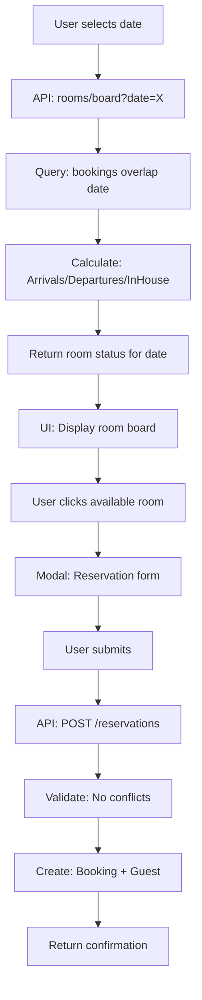

# Future Date Reservation System - Architectural Plan

## Executive Summary

The current system supports making bookings for future dates, but the **Room Board only displays today's data**. Staff cannot view room status for future dates, and reservations must be made through separate booking workflows.

This plan outlines a comprehensive system to enable **date navigation on the Room Board** and **seamless future date reservations** without conflicts.

---

## Current State Analysis

### What Already Exists

| Component | Status | Location |
|-----------|--------|----------|
| Booking Model (checkIn/checkOut) | ✅ Working | `schema.prisma:341-439` |
| getAvailableRooms() with overlap detection | ✅ Working | `roomQueries.ts:21-42` |
| Room conflict detection | ✅ Working | `roomConflictQueries.ts` |
| Booking status workflow | ✅ Working | `bookingQueries.ts` |
| Today's Room Board | ✅ Working | Front Office & Admin |

### What Is Missing

1. **Date Navigation on Room Board** - Can only view today
2. **Future Date Reservations from Room Board** - Must use separate booking flow
3. **Visual Timeline View** - No week/month calendar view
4. **Room Hold Functionality** - Temporary holds before confirmation
5. **Drag-and-Drop Booking** - Intuitive reservation creation

---

## Proposed System Architecture

### 1. Multi-Date Room Board

#### 1.1 API Enhancement: Room Board for Any Date

**File:** `apps/front-office/src/app/api/rooms/board/route.ts`
**File:** `apps/admin/src/app/api/rooms/board/route.ts`

```typescript
// Request: GET /api/rooms/board?date=2025-07-15
// Response includes:
// - rooms: Room[] with currentBooking (if any) for that date
// - arrivals: Booking[] arriving on that date
// - departures: Booking[] departing on that date
// - inHouse: Booking[] checked-in and staying on that date
```

**Changes Required:**
- Accept `date` query parameter (defaults to today)
- Calculate arrivals/departures/inHouse based on the selected date
- A room is "occupied" on a date if: `booking.checkIn <= date < booking.checkOut` AND status is `CONFIRMED` or `CHECKED_IN`
- A room is "arriving" on a date if: `booking.checkIn == date`
- A room is "departing" on a date if: `booking.checkOut == date`

#### 1.2 UI: Date Navigation Component

**File:** `apps/front-office/src/app/(dashboard)/rooms/board/page.tsx`
**File:** `apps/admin/src/app/(dashboard)/room-board/page.tsx`

**Features:**
- Date picker to select any future date
- "Today" quick button
- Previous/Next day arrows
- Week view toggle (shows 7-day horizontal timeline)
- Color-coded room status for future dates

#### 1.3 Room Status Logic for Future Dates

| Status | Condition |
|--------|-----------|
| **Available** | No booking overlaps with selected date |
| **Arriving** | checkIn == selected date AND status == CONFIRMED |
| **In-House** | checkIn < selected date < checkOut AND status == CHECKED_IN |
| **Departing** | checkOut == selected date |
| **Out of Order** | room.status == OUT_OF_ORDER |
| **Blocked** | room.status == BLOCKED |

---

### 2. Seamless Reservation Creation from Room Board

#### 2.1 UI: Click Room to Reserve

**Interaction Flow:**
1. User clicks on an **Available** room for a future date
2. Modal opens: "Create Reservation for Room [X] on [Date]"
3. Pre-filled: Room (locked), Check-in date, Check-out date (default: next day)
4. User enters: Guest info (search or new), guests count, booking source
5. "Check Availability" button - validates no conflicts
6. "Confirm Reservation" - creates booking with status CONFIRMED

**File:** `apps/front-office/src/app/(dashboard)/rooms/board/page.tsx`

#### 2.2 New API: Create Reservation

**File:** `apps/front-office/src/app/api/reservations/route.ts`

```typescript
POST /api/reservations
{
  roomId: string,
  checkIn: string (YYYY-MM-DD),
  checkOut: string (YYYY-MM-DD),
  guestId?: string (existing guest),
  guest?: { name, email, phone } (new guest),
  guestsCount: number,
  bookingSource: BookingSource,
  specialRequests?: string
}
```

**Validation:**
1. Verify room is available for date range (no overlapping CONFIRMED/CHECKED_IN)
2. Verify room is not OUT_OF_ORDER or BLOCKED for those dates
3. Create guest if new
4. Calculate pricing
5. Create booking with status CONFIRMED
6. Return booking details

#### 2.3 Conflict Prevention

The key issue with future date bookings is **double-booking**. Two staff members might try to book the same room simultaneously.

**Solution: Optimistic Locking with Validation**

```typescript
// Before creating booking, check:
// 1. Room not booked (already in getAvailableRooms)
// 2. Room not blocked/OOS
// 3. Use transaction with unique constraint on (roomId, checkIn, checkOut)
```

**Database Constraint:**
```prisma
// No overlapping bookings for same room
@@index([roomId, checkIn, checkOut])
```

---

### 3. Room Hold (Optional Pre-Reservation)

For OTA channels and电话 reservations, you may want to temporarily hold a room before full confirmation.

#### 3.1 Room Hold Model

```typescript
// New model in schema.prisma
model RoomHold {
  id        String   @id @default(cuid())
  roomId    String
  checkIn   DateTime
  checkOut  DateTime
  guestName String
  guestPhone String
  expiresAt DateTime  // 30 minutes from creation
  status    HoldStatus @default(ACTIVE)
  // ...
}
```

#### 3.2 Hold API

- `POST /api/room-holds` - Create hold
- `DELETE /api/room-holds/[id]` - Release hold
- `GET /api/room-holds?roomId=X` - Check active holds for room

---

### 4. Timeline/Calendar View (Week View)

#### 4.1 UI: Horizontal Week Timeline

**File:** `apps/front-office/src/app/(dashboard)/rooms/board/week/page.tsx`

**Display:**
- Y-axis: Rooms (sorted by floor/number)
- X-axis: Days (7-day view, scrollable)
- Cells show: Guest name, booking number (for arrivals/departures)
- Color coding by booking status

**Benefits:**
- Visual overview of week's occupancy
- Spot gaps in booking
- See patterns (e.g., high departure on Saturdays)

---

## Implementation Plan

### Phase 1: Multi-Date Room Board (Critical)

#### Step 1.1: Update Room Board API
- [ ] Add `date` query parameter (default: today)
- [ ] Recalculate arrivals/departures/inHouse based on date
- [ ] Add propertyId filtering
- [ ] Return proper room status for selected date

#### Step 1.2: Update Room Board UI
- [ ] Add date picker component
- [ ] Add Today/Prev/Next navigation
- [ ] Show arrivals count badge
- [ ] Show departures count badge
- [ ] Click available room to create reservation

#### Step 1.3: Create Reservation API
- [ ] `POST /api/reservations` with validation
- [ ] Availability check before booking
- [ ] Transaction for booking creation
- [ ] Audit log entry

### Phase 2: Enhanced Features

#### Step 2.1: Room Hold System
- [ ] Add RoomHold model
- [ ] Create hold API
- [ ] Auto-expire holds
- [ ] Integrate with availability check

#### Step 2.2: Week View
- [ ] Create week view page
- [ ] Horizontal timeline component
- [ ] Click to view booking details
- [ ] Navigate weeks

---

## File Changes Summary

### APIs to Create
| File | Purpose |
|------|---------|
| `apps/front-office/src/app/api/reservations/route.ts` | Create reservation from room board |
| `apps/admin/src/app/api/reservations/route.ts` | Admin reservation creation |

### APIs to Modify
| File | Changes |
|------|---------|
| `apps/front-office/src/app/api/rooms/board/route.ts` | Add date parameter, arrivals/departures |
| `apps/admin/src/app/api/rooms/board/route.ts` | Add date parameter, arrivals/departures |

### Pages to Create
| File | Purpose |
|------|---------|
| `week/page.tsx` | Week timeline view |

### Pages to Modify
| File | Changes |
|------|---------|
| `rooms/board/page.tsx` | Add date picker, reservation modal |
| `room-board/page.tsx` | Add date picker, reservation modal |

### Database (if Room Hold needed)
| Change | File |
|--------|------|
| Add RoomHold model | `schema.prisma` |

---

## Data Flow Diagram



---

## Edge Cases

| Scenario | Handling |
|----------|----------|
| Double-booking attempt | Transaction with unique constraint, return error |
| Room marked OOS after reservation | Show warning at check-in, offer alternative |
| Guest cancels future reservation | Update booking status, room becomes available |
| Overlapping dates (back-to-back) | checkout == next checkin is OK |
| Same-day booking | checkIn = today, checkout = tomorrow |

---

## Testing Checklist

- [ ] Room board shows correct arrivals for any date
- [ ] Room board shows correct departures for any date
- [ ] Room board shows correct in-house for any date
- [ ] Can create reservation for future date
- [ ] Cannot double-book same room
- [ ] Date navigation works correctly
- [ ] Past dates show historical data (read-only)
- [ ] Room status colors are correct
