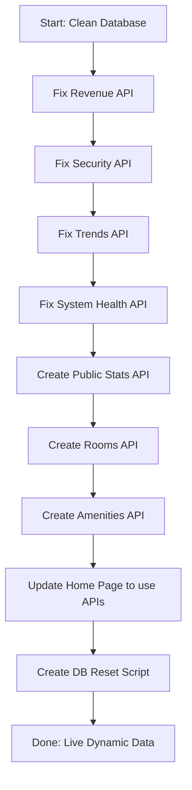

# Mock Data Removal & Live Data Integration Plan

## Executive Summary

This plan addresses the removal of hardcoded/mock data across the application and replaces it with live, dynamic data fetched from APIs and the database.

---

## Findings Summary

### Clean Applications (No Mock Data)
- ✅ **admin** - No mock data found
- ✅ **front-office** - UI constants only (navigation, form options)
- ✅ **guest-portal** - UI constants only (navigation, document types, addon options)

### Applications with Mock Data

| App | File | Issue |
|-----|------|-------|
| `super-admin` | `api/analytics/revenue/route.ts` | Hardcoded `expenses`, `adr`, occupancy numbers |
| `super-admin` | `api/security/route.ts` | Mock `sessions`, `checks`, `compliance` arrays |
| `super-admin` | `api/analytics/trends/route.ts` | Hardcoded RevPAR calculation (`0.78` occupancy assumption) |
| `super-admin` | `api/system-health/route.ts` | Mock `checkRedis()`, `checkMinIO()`, `checkNginx()` |
| `web` | `(marketing)/home/page.tsx` | Hardcoded `HERO_SLIDES`, `FEATURED_AMENITIES`, `ROOM_PREVIEWS`, stats |

---

## Detailed Implementation Plan

### 1. Fix [`apps/super-admin/src/app/api/analytics/revenue/route.ts`](apps/super-admin/src/app/api/analytics/revenue/route.ts)

**Issues:**
- Lines 56, 64, 72, 80: Hardcoded `expenses` (₹4,200, ₹31,500, ₹1,42,300, ₹18,23,400)
- Lines 59, 67, 75, 83: Hardcoded `adr` (₹1,922, ₹1,847, ₹1,847, ₹1,789)
- Lines 100-101, 110-111: Hardcoded `daily`/`monthly` occupancy counts

**Fix:** Replace hardcoded values with real calculations from the database:
- Fetch actual expenses from `db.expense.findMany()` for the period
- Calculate ADR dynamically from bookings: `totalRevenue / occupiedNights`
- Calculate occupancy from `db.room.count({ where: { status: "OCCUPIED" } })`

---

### 2. Fix [`apps/super-admin/src/app/api/security/route.ts`](apps/super-admin/src/app/api/security/route.ts)

**Issues:**
- Lines 13-19: Hardcoded `checks` array (security audit results)
- Lines 22-25: Mock `sessions` array marked with `// Mock active sessions`
- Lines 27-31: Hardcoded `compliance` array

**Fix:**
- `checks`: Implement real security checks (2FA enforcement, password policy, etc.)
- `sessions`: Query actual user sessions from database or remove if using stateless JWTs
- `compliance`: Fetch from a `complianceAudits` table or external audit service

---

### 3. Fix [`apps/super-admin/src/app/api/analytics/trends/route.ts`](apps/super-admin/src/app/api/analytics/trends/route.ts)

**Issue:**
- Line 85: `const revpar = adr * 0.78;` — Uses hardcoded 78% occupancy assumption

**Fix:** Calculate RevPAR correctly:
```typescript
// RevPAR = Total Room Revenue / Total Available Room-Days
const revpar = totalRevenue / (totalRooms * daysInPeriod);
```

---

### 4. Fix [`apps/super-admin/src/app/api/system-health/route.ts`](apps/super-admin/src/app/api/system-health/route.ts)

**Issues:**
- `checkRedis()` (lines 38-49): Returns mock data `"Memory: 42MB / 256MB, Keys: 1,247"`
- `checkMinIO()` (lines 51-61): Returns mock data `"Disk: 23% used (92GB / 400GB), 4 buckets"`
- `checkNginx()` (lines 102-112): Returns mock data `"12 active connections, SSL valid (90 days)"`

**Fix:**
- `checkRedis()`: Implement using `ioredis` package to ping Redis server
- `checkMinIO()`: Implement using `@aws-sdk/client-s3` to check bucket/usage
- `checkNginx()`: Query nginx status endpoint or remove if not available

---

### 5. Fix [`apps/web/src/app/(marketing)/home/page.tsx`](apps/web/src/app/(marketing)/home/page.tsx)

**Issues:**
- `HERO_SLIDES` (lines 10-35): Hardcoded promotional slides
- `FEATURED_AMENITIES` (lines 44-49): Hardcoded amenities list
- `ROOM_PREVIEWS` (lines 51-68): Hardcoded room types with prices
- Stats section (lines 328-333): Hardcoded "36 Rooms", "18+ Years", "4.8 Rating", "24/7 Support"

**Fix:** Convert to client-side fetching from APIs:

```typescript
// Fetch rooms from API
const [rooms, amenities, stats] = await Promise.all([
  fetch('/api/rooms').then(r => r.json()),
  fetch('/api/amenities').then(r => r.json()),
  fetch('/api/stats').then(r => r.json()),
]);
```

**New API endpoints needed:**
- `GET /api/rooms` - Returns available room types with live pricing
- `GET /api/amenities` - Returns all amenities from database
- `GET /api/public-stats` - Returns public stats (total rooms, rating, etc.)
- `GET /api/announcements?type=hero` - Returns active hero slides/promotions

---

### 6. Database Seed File

The [`packages/db/prisma/seed.ts`](packages/db/prisma/seed.ts) contains:
- ✅ **Amenities** (baseline reference data)
- ✅ **Rooms** (36 rooms with pricing)
- ✅ **Admin users** (default credentials)
- ✅ **Welcome announcement**
- ✅ **Discount codes**

**Recommendation:** The seed file is **baseline foundational data**, not mock transactional data. Keep it as-is since it's needed for the app to function. However, create a reset script (see below).

---

## Implementation Sequence



---

## Files to Modify

| Priority | File | Changes |
|----------|------|---------|
| P0 | `apps/super-admin/src/app/api/analytics/revenue/route.ts` | Remove hardcoded expenses/ADR |
| P0 | `apps/super-admin/src/app/api/security/route.ts` | Remove mock sessions/checks |
| P0 | `apps/super-admin/src/app/api/analytics/trends/route.ts` | Fix RevPAR calculation |
| P1 | `apps/super-admin/src/app/api/system-health/route.ts` | Implement real health checks |
| P1 | `apps/web/src/app/(marketing)/home/page.tsx` | Add API fetching |
| P2 | `apps/web/src/app/api/rooms/route.ts` | Create new API endpoint |
| P2 | `apps/web/src/app/api/amenities/route.ts` | Create new API endpoint |
| P2 | `apps/web/src/app/api/public-stats/route.ts` | Create new API endpoint |
| P3 | `scripts/reset-database.ts` | Create database reset script |

---

## New API Endpoints Required

### `GET /api/rooms`
Returns available room types with live pricing for the marketing site.

### `GET /api/amenities`
Returns all amenities for the marketing site.

### `GET /api/public-stats`
Returns public-facing stats:
- Total room count
- Average guest rating
- Years of service
- Support availability

### `GET /api/announcements?type=hero`
Returns active hero slides/promotions for the marketing site.

---

## Database Reset Script

Create `scripts/reset-database.ts`:
```typescript
// Truncates all transactional tables while preserving:
// - Users (admin accounts)
// - Rooms
// - Amenities
// - RoomAmenities
// - Discounts
```

---

## Testing Checklist

After implementation, verify:
- [ ] Super Admin Dashboard loads with live data
- [ ] Revenue analytics shows actual values (not hardcoded)
- [ ] Security page shows real session/checks data
- [ ] System health shows actual service statuses
- [ ] Marketing home page loads rooms/amenities from database
- [ ] No console errors related to mock data
