# Hotel Reservation & Check-In System Architecture

**Version:** 1.0  
**Date:** 2026-06-15  
**Status:** Draft

---

## Table of Contents

1. [Overview](#1-overview)
2. [Data Models](#2-data-models)
3. [Booking Lifecycle State Machine](#3-booking-lifecycle-state-machine)
4. [API Endpoints Structure](#4-api-endpoints-structure)
5. [Scenario Implementation Flows](#5-scenario-implementation-flows)
6. [Room Assignment Algorithm](#6-room-assignment-algorithm)
7. [OTA Sync Mechanisms](#7-ota-sync-mechanisms)
8. [Waitlist Handling](#8-waitlist-handling)
9. [Duplicate Detection Logic](#9-duplicate-detection-logic)
10. [Implementation Phases](#10-implementation-phases)

---

## 1. Overview

This document defines the comprehensive architecture for a hotel reservation and check-in system covering 12 core scenarios. The system is built on an existing monorepo with:

- **Front-office app** at `apps/front-office` (React pages in `app/(dashboard)/bookings/`)
- **Admin app** at `apps/admin` (webhook handlers in `app/api/webhooks/`)
- **Database package** at `packages/db` (Prisma schema)
- **Channel manager** at `packages/channel-manager` (OTA integrations)

### Design Principles

1. **Booking number format:** `BKN-YYYYMMDD-XXXX`
2. **Room status:** `VACANT`, `OCCUPIED`, `MAINTENANCE`, `BLOCKED`
3. **Booking statuses:** `CONFIRMED`, `CHECKED_IN`, `CHECKED_OUT`, `CANCELLED`, `NO_SHOW`
4. **Role-based access:** `GUEST`, `FRONT_OFFICE`, `ADMIN`, `SUPER_ADMIN`
5. **Decimal handling:** All monetary amounts use `Prisma.Decimal(10,2)` in INR

---

## 2. Data Models

### 2.1 Existing Models (Schema.prisma)

#### Guest
```prisma
model Guest {
  id              String    @id @default(cuid())
  name            String
  phone           String
  email           String?
  alternatePhone  String?
  address         String?
  city            String?
  state           String?
  pincode         String?
  dateOfBirth     DateTime?
  companyName     String?
  stayCount       Int       @default(0)
  loyaltyTier     LoyaltyTier @default(BRONZE)
  notes           String?
  isBlacklisted   Boolean   @default(false)
  blacklistReason String?
  createdAt       DateTime  @default(now())
  updatedAt       DateTime  @updatedAt
  bookings        Booking[]
  documents      GuestDocument[]
  blacklistEntry GuestBlacklist?
}
```

#### Booking
```prisma
model Booking {
  id              String        @id @default(cuid())
  bookingNumber   String        @unique
  propertyId      String        @default("default")
  guestId        String
  guest          Guest         @relation(fields: [guestId], references: [id])
  roomId         String
  room           Room          @relation(fields: [roomId], references: [id])
  property       Property      @relation(fields: [propertyId], references: [id])
  checkIn        DateTime
  checkOut       DateTime
  guestsCount    Int           @default(1)
  bookingType    BookingType   @default(DAILY)
  bookingSource  BookingSource @default(WEBSITE)
  status         BookingStatus @default(CONFIRMED)
  paymentStatus  PaymentStatus @default(PENDING)
  baseAmount     Decimal       @db.Decimal(10, 2)
  discountAmount Decimal       @db.Decimal(10, 2) @default(0)
  extrasAmount   Decimal       @db.Decimal(10, 2) @default(0)
  totalAmount    Decimal       @default(0) @db.Decimal(10, 2)
  specialRequests String?
  discountCode   String?
  discountType   String?
  signatureUrl   String?
  complimentaryReason String?
  checkInTime   DateTime?
  checkOutTime  DateTime?
  noShowAt      DateTime?
  noShowCharge  Decimal?     @db.Decimal(10, 2)
  groupBookingId String?
  groupBooking   GroupBooking? @relation(fields: [groupBookingId], references: [id])
  isOverbooking  Boolean   @default(false)
  createdById   String?
  createdBy     User?        @relation(fields: [createdById], references: [id])
  createdAt     DateTime     @default(now())
  updatedAt     DateTime     @updatedAt
  // ... relations
}
```

#### Room
```prisma
model Room {
  id                  String      @id @default(cuid())
  propertyId          String      @default("default")
  roomNumber         String      @unique
  type              RoomType
  floor             Int
  status            RoomStatus  @default(VACANT)
  cleaningStatus    CleaningStatus @default(CLEAN)
  description       String?
  maxOccupancy      Int         @default(2)
  sizeSqft          Int?
  basePriceSingle   Decimal     @db.Decimal(10, 2)
  basePriceDouble   Decimal     @db.Decimal(10, 2)
  monthlyPriceSingle Decimal?   @db.Decimal(10, 2)
  monthlyPriceDouble Decimal?   @db.Decimal(10, 2)
  internalNotes    String?
  cleaningNotes    String?
  lastCleanedAt     DateTime?
  cleanedById       String?
  isPriorityCleaning Boolean   @default(false)
  priorityReason     String?
  createdAt         DateTime    @default(now())
  updatedAt         DateTime   @updatedAt
  // ... relations
}
```

#### GroupBooking
```prisma
model GroupBooking {
  id              String    @id @default(cuid())
  groupCode       String    @unique
  propertyId      String    @default("default")
  property        Property  @relation(fields: [propertyId], references: [id])
  name            String
  contactPerson   String?
  contactPhone    String?
  contactEmail    String?
  billingType     GroupBillingType @default(INDIVIDUAL)
  checkInDate     DateTime  @db.Date
  checkOutDate    DateTime  @db.Date
  status          GroupBookingStatus @default(CONFIRMED)
  createdById      String?
  createdBy        User?     @relation("GroupBookingCreatedBy", fields: [createdById], references: [id])
  createdAt        DateTime  @default(now())
  updatedAt        DateTime  @updatedAt
  bookings        Booking[]
}
```

### 2.2 New Models Required

#### Waitlist
```prisma
model Waitlist {
  id              String    @id @default(cuid())
  waitlistNumber  String    @unique  // WTL-YYYYMMDD-XXXX
  propertyId      String    @default("default")
  
  // Guest info
  guestName       String
  guestPhone      String
  guestEmail      String?
  
  // Requested booking details
  roomType        RoomType
  checkIn         DateTime  @db.Date
  checkOut        DateTime  @db.Date
  guestsCount     Int       @default(1)
  
  // Priority and status
  priority        Int       @default(0)  // Higher = more priority
  status          WaitlistStatus @default(WAITING)
  
  // Expiry
  expiresAt       DateTime?  // When this waitlist entry expires
  notifiedAt      DateTime?  // When guest was last notified
  
  // Resolution
  resolvedAt      DateTime?
  resolvedBookingId String?  // Booking created from this waitlist
  resolvedReason  String?
  
  createdAt       DateTime  @default(now())
  updatedAt       DateTime  @updatedAt
  
  @@index([roomType, checkIn, checkOut, status])
  @@index([status, priority])
  @@map("waitlist")
}

enum WaitlistStatus {
  WAITING       // Active, waiting for room
  NOTIFIED      // Guest notified that room is available
  CONVERTED     // Converted to booking
  EXPIRED       // Waitlist entry expired
  CANCELLED     // Guest cancelled waitlist request
}
```

#### BookingRoomAssignment
```prisma
model BookingRoomAssignment {
  id              String    @id @default(cuid())
  bookingId       String    @unique
  booking         Booking   @relation(fields: [bookingId], references: [id])
  
  // Assignment type
  assignmentType  AssignmentType
  
  // Pre-assigned room (for ASSIGNED type)
  preAssignedRoomId String?
  preAssignedAt    DateTime?
  
  // Auto-assigned room (for AUTO type, assigned at check-in)
  autoAssignedRoomId String?
  autoAssignedAt   DateTime?
  
  // Final room (actual room assigned)
  finalRoomId     String?
  
  // Lock on room to prevent double-assignment
  roomLockId      String?
  roomLockExpiresAt DateTime?
  
  createdAt       DateTime  @default(now())
  updatedAt       DateTime  @updatedAt
  
  @@map("booking_room_assignments")
}

enum AssignmentType {
  PRE_ASSIGNED    // Room assigned at booking time
  AUTO_ASSIGN     // Room auto-assigned at check-in
  ON_DEMAND       // Room assigned on guest request
}
```

#### RoomHold
```prisma
model RoomHold {
  id              String    @id @default(cuid())
  roomId          String
  room            Room      @relation(fields: [roomId], references: [id])
  
  // Hold context
  holdType        RoomHoldType
  bookingId       String?   // If hold is for a specific booking
  waitlistId      String?   // If hold is for a waitlist entry
  
  // Hold period
  checkIn         DateTime  @db.Date
  checkOut        DateTime  @db.Date
  
  // Expiry
  expiresAt       DateTime
  releasedAt      DateTime?
  
  // Status
  status          RoomHoldStatus @default(ACTIVE)
  
  createdAt       DateTime  @default(now())
  
  @@index([roomId, checkIn, checkOut, status])
  @@map("room_holds")
}

enum RoomHoldType {
  BOOKING         // Hold for confirmed booking
  PRE_ASSIGN      // Hold for pre-assigned room
  WAITLIST        // Hold for waitlist (priority)
  HOUSEKEEPING    // Temporary hold for cleaning
}

enum RoomHoldStatus {
  ACTIVE
  RELEASED
  CONVERTED       // Converted to actual booking
  EXPIRED
}
```

#### DuplicateBookingCandidate
```prisma
model DuplicateBookingCandidate {
  id              String    @id @default(cuid())
  
  // Detection details
  detectedAt      DateTime  @default(now())
  status          DuplicateStatus @default(PENDING)
  
  // Linked bookings
  primaryBookingId String
  duplicateBookingId String
  
  // Detection criteria
  matchType       DuplicateMatchType  // Exact match or fuzzy
  matchFields     String[]  // Which fields matched
  
  // Resolution
  resolvedAt      DateTime?
  resolvedById    String?
  resolution      String?   // KEPT_PRIMARY, MERGED, BOTH_KEPT
  
  notes           String?
  
  @@map("duplicate_booking_candidates")
}

enum DuplicateMatchType {
  EXACT_PHONE
  EXACT_EMAIL
  EXACT_DATES_ROOM
  FUZZY_NAME
  FUZZY_PHONE
}

enum DuplicateStatus {
  PENDING
  REVIEWED
  RESOLVED
  DISMISSED
}
```

#### LateArrivalPolicy
```prisma
model LateArrivalPolicy {
  id              String    @id @default(cuid())
  propertyId      String    @default("default")
  
  // Late arrival window
  lateArrivalStartHour Int   @default(0)   // 00:00 (midnight)
  lateArrivalEndHour   Int   @default(6)   // 06:00
  
  // Auto-check-in settings
  autoCheckInEnabled Boolean @default(false)
  autoCheckInCutoffHour Int @default(4)    // Auto check-in by 4 AM
  
  // Guest notification
  notifyGuest Boolean @default(true)
  notificationTemplateId String?
  
  // Special handling
  requireManualCheckIn Boolean @default(true)
  allowAutoRoomAssignment Boolean @default(false)
  
  updatedAt       DateTime  @updatedAt
  
  @@unique([propertyId])
  @@map("late_arrival_policies")
}
```

### 2.3 Schema Additions to Existing Models

#### Booking - Add fields
```prisma
// Add to Booking model:
roomAssignmentType  AssignmentType?  // PRE_ASSIGNED, AUTO_ASSIGN
earlyCheckInRequested Boolean @default(false)
earlyCheckInApproved  Boolean @default(false)
lateArrivalInfo       Json?   // { expectedTime, flightNumber, notes }
corporateAccountId    String? // For corporate billing
isGroupLeader         Boolean @default(false)
parentBookingId       String? // For split group bookings
```

#### HotelSettings - Add fields
```prisma
// Add to HotelSettings model:
autoCheckInEnabled      Boolean @default(false)
autoCheckInCutoffHour   Int?    @default(4)
duplicateCheckEnabled   Boolean @default(true)
duplicateCheckWindowHours Int @default(24)  // Hours to check for duplicates
waitlistAutoNotify      Boolean @default(true)
waitlistNotifyTemplate  String?
preAssignmentEnabled   Boolean @default(true)
preAssignmentCutoffHours Int   @default(4)  // Hours before check-in to auto-pre-assign
```

---

## 3. Booking Lifecycle State Machine

### 3.1 Core States

```
┌─────────────────────────────────────────────────────────────────────────────┐
│                        BOOKING LIFECYCLE STATE MACHINE                      │
├─────────────────────────────────────────────────────────────────────────────┤
│                                                                             │
│   ┌──────────┐         ┌─────────────┐         ┌────────────┐             │
│   │ HOLD     │────────►│ CONFIRMED   │────────►│ CHECKED_IN │             │
│   └──────────┘         └─────────────┘         └────────────┘             │
│        │                      │                      │                        │
│        │                      │                      │                        │
│        ▼                      ▼                      ▼                        │
│   ┌──────────┐         ┌───────────┐         ┌────────────┐               │
│   │ EXPIRED  │         │ CANCELLED │         │ CHECKED_OUT│               │
│   └──────────┘         └───────────┘         └────────────┘               │
│                             │                                               │
│                             │                    ┌────────────┐              │
│                             └───────────────────►│  NO_SHOW   │              │
│                                                    └────────────┘              │
│                                                                             │
└─────────────────────────────────────────────────────────────────────────────┘
```

### 3.2 State Definitions

| State | Description | Entry Actions | Exit Actions |
|-------|-------------|---------------|--------------|
| `HOLD` | Temporary reservation while processing payment | Create room hold | Convert to CONFIRMED or EXPIRE |
| `CONFIRMED` | Booking confirmed, room assigned | Validate room availability | Check-in, cancel, or no-show |
| `CHECKED_IN` | Guest has checked in | Update room status to OCCUPIED | Check-out |
| `CHECKED_OUT` | Guest has checked out | Update room status to VACANT | Terminal state |
| `CANCELLED` | Booking cancelled | Release room hold, process refund | Terminal state |
| `NO_SHOW` | Guest did not check in | Apply no-show charge | Terminal state |
| `EXPIRED` | Hold expired without payment | Release room hold | Terminal state |

### 3.3 Transition Guards

```typescript
const BOOKING_TRANSITION_GUARDS = {
  HOLD_TO_CONFIRMED: (booking, params) => {
    // Payment must be received
    // Room must still be available
    // Guest not blacklisted
  },
  
  CONFIRMED_TO_CHECKED_IN: (booking, params) => {
    // Room must be VACANT
    // Room cleaningStatus should be CLEAN (warning if DIRTY)
    // Documents verified (if required)
    // Early check-in fee applied if applicable
  },
  
  CONFIRMED_TO_CANCELLED: (booking, params) => {
    // Before cancellation cutoff
    // Process refund if applicable
  },
  
  CONFIRMED_TO_NO_SHOW: (booking, params) => {
    // After no-show cutoff time
    // Apply no-show charge
  },
  
  CHECKED_IN_TO_CHECKED_OUT: (booking, params) => {
    // PaymentStatus must be PAID
    // No pending disputes
  }
}
```

### 3.4 Booking Source Types

```typescript
enum BookingSource {
  WALK_IN       // Direct walk-in booking
  PHONE         // Phone reservation
  WEBSITE       // Direct website booking
  OTA           // Booking.com, Agoda, Expedia, Airbnb
  CORPORATE     // Corporate account booking
  GROUP         // Group booking
  COMPLIMENTARY // Free booking
}
```

### 3.5 Payment Status Flow

```
┌──────────┐     ┌─────────┐     ┌────────┐     ┌────────┐
│ PENDING  │────►│ PARTIAL │────►│  PAID  │────►│OVERPAID│
└──────────┘     └─────────┘     └────────┘     └────────┘
     │                │              │
     │                │              ▼
     │                │         ┌─────────┐
     └────────────────┴────────►│ REFUNDED│
                               └─────────┘
```

---

## 4. API Endpoints Structure

### 4.1 Booking API Routes

```
apps/front-office/src/app/api/
├── bookings/
│   ├── route.ts                    # GET (list), POST (create)
│   ├── today/route.ts              # GET today's check-ins/check-outs
│   ├── [id]/
│   │   ├── route.ts                # GET, PATCH, DELETE
│   │   ├── check-in/route.ts       # POST check-in
│   │   ├── check-out/route.ts      # POST check-out
│   │   ├── extend/route.ts         # POST extend stay
│   │   ├── reassign/route.ts       # POST reassign room
│   │   └── cancel/route.ts          # POST cancel
│   ├── new/route.ts                # POST walk-in booking
│   ├── reservation/route.ts        # POST advance reservation
│   ├── waitlist/
│   │   ├── route.ts                # GET, POST waitlist
│   │   └── [id]/route.ts          # GET, PATCH, DELETE waitlist entry
│   ├── duplicates/
│   │   ├── route.ts                # GET pending duplicates
│   │   └── [id]/route.ts           # POST resolve duplicate
│   ├── group/
│   │   ├── route.ts                # POST create group booking
│   │   └── [id]/
│   │       ├── route.ts           # GET, PATCH group
│   │       ├── split/route.ts     # POST split group
│   │       └── bulk-checkin/route.ts
│   └── ota/
│       ├── route.ts               # GET OTA bookings
│       └── sync/route.ts          # POST trigger OTA sync
```

### 4.2 Room Assignment API Routes

```
apps/front-office/src/app/api/rooms/
├── board/route.ts                  # GET room board status
├── availability/route.ts           # GET available rooms for date range
├── [id]/
│   ├── route.ts                    # GET room details
│   ├── clean/route.ts             # POST mark as cleaned
│   ├── mark-dirty/route.ts        # POST mark as dirty
│   └── hold/route.ts             # POST create room hold
├── assign/
│   ├── auto/route.ts              # POST auto-assign room
│   └── pre/route.ts               # POST pre-assign room
└── holds/route.ts                 # GET active room holds
```

### 4.3 Webhook API Routes

```
apps/admin/src/app/api/webhooks/
├── booking-com/route.ts            # Booking.com webhook
├── agoda/route.ts                  # Agoda webhook
├── expedia/route.ts                # Expedia webhook
└── airbnb/route.ts                # Airbnb webhook
```

### 4.4 Request/Response Schemas

#### Create Walk-in Booking Request
```typescript
interface CreateWalkinBookingRequest {
  guest: {
    name: string;
    phone: string;
    email?: string;
    address?: string;
  };
  roomType: 'STUDIO' | 'PREMIUM';
  checkIn: string;      // ISO date
  checkOut: string;     // ISO date
  guestsCount: number;
  bookingType: 'DAILY' | 'MONTHLY';
  paymentMethod: 'CASH' | 'UPI' | 'CARD' | 'ONLINE';
  paymentAmount?: number;
  discountCode?: string;
  specialRequests?: string;
  assignmentType: 'PRE_ASSIGNED' | 'AUTO_ASSIGN';
  preAssignedRoomId?: string;
}
```

#### Create Waitlist Request
```typescript
interface CreateWaitlistRequest {
  guestName: string;
  guestPhone: string;
  guestEmail?: string;
  roomType: 'STUDIO' | 'PREMIUM';
  checkIn: string;
  checkOut: string;
  guestsCount?: number;
  priority?: number;
  notifyVia?: 'SMS' | 'EMAIL' | 'WHATSAPP';
}
```

#### Group Booking Request
```typescript
interface CreateGroupBookingRequest {
  name: string;
  contactPerson?: string;
  contactPhone?: string;
  contactEmail?: string;
  billingType: 'SHARED' | 'INDIVIDUAL' | 'MIXED';
  checkInDate: string;
  checkOutDate: string;
  rooms: {
    roomType: 'STUDIO' | 'PREMIUM';
    count: number;
    guestsPerRoom?: number[];
  }[];
  guestDetails: {
    name: string;
    phone: string;
    email?: string;
    roomType: 'STUDIO' | 'PREMIUM';
  }[];
  corporateAccountId?: string;
}
```

---

## 5. Scenario Implementation Flows

### 5.1 Walk-in Guest Booking with Instant Room Allocation

**Flow:**
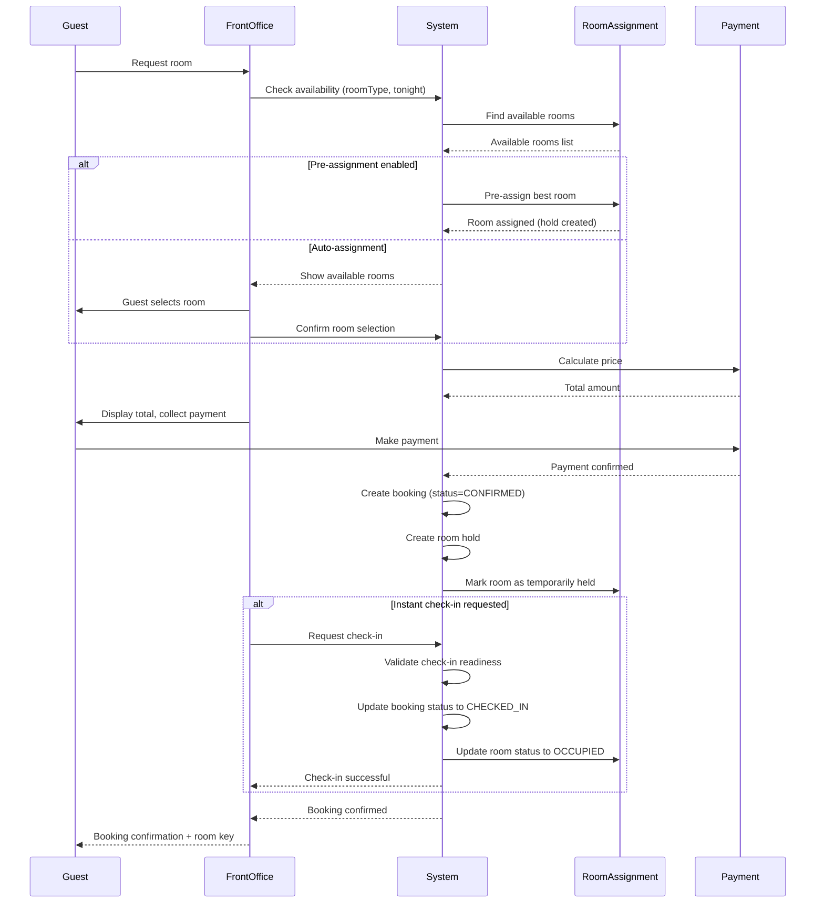
```mermaid
sequenceDiagram
    participant Guest
    participant FrontOffice
    participant System
    participant RoomAssignment
    participant Payment
    
    Guest->>FrontOffice: Request room
    FrontOffice->>System: Check availability (roomType, tonight)
    System->>RoomAssignment: Find available rooms
    RoomAssignment-->>System: Available rooms list
    
    alt Pre-assignment enabled
        System->>RoomAssignment: Pre-assign best room
        RoomAssignment-->>System: Room assigned (hold created)
    else Auto-assignment
        System-->>FrontOffice: Show available rooms
        FrontOffice->>Guest: Guest selects room
        FrontOffice->>System: Confirm room selection
    end
    
    System->>Payment: Calculate price
    Payment-->>System: Total amount
    
    FrontOffice->>Guest: Display total, collect payment
    Guest->>Payment: Make payment
    Payment-->>System: Payment confirmed
    
    System->>System: Create booking (status=CONFIRMED)
    System->>System: Create room hold
    System->>RoomAssignment: Mark room as temporarily held
    
    alt Instant check-in requested
        FrontOffice->>System: Request check-in
        System->>System: Validate check-in readiness
        System->>System: Update booking status to CHECKED_IN
        System->>RoomAssignment: Update room status to OCCUPIED
        System-->>FrontOffice: Check-in successful
    end
    
    System-->>FrontOffice: Booking confirmed
    FrontOffice-->>Guest: Booking confirmation + room key
```

**Implementation:**
```typescript
// packages/db/src/queries/bookingQueries.ts

export async function createWalkinBooking(data: {
  guest: CreateGuestData;
  roomType: RoomType;
  checkIn: Date;
  checkOut: Date;
  guestsCount: number;
  bookingType: 'DAILY' | 'MONTHLY';
  paymentMethod: PaymentMethod;
  paymentAmount?: number;
  discountCode?: string;
  specialRequests?: string;
  assignmentType: 'PRE_ASSIGNED' | 'AUTO_ASSIGN';
  preAssignedRoomId?: string;
  createdById?: string;
}) {
  return prisma.$transaction(async (tx) => {
    // 1. Find or create guest
    let guest = await tx.guest.findFirst({
      where: { phone: data.guest.phone }
    });
    if (!guest) {
      guest = await tx.guest.create({
        data: {
          name: data.guest.name,
          phone: data.guest.phone,
          email: data.guest.email,
          address: data.guest.address,
        }
      });
    }
    
    // 2. Check for duplicates
    const duplicateCheck = await checkDuplicateBooking(tx, {
      guestId: guest.id,
      checkIn: data.checkIn,
      checkOut: data.checkOut,
      roomType: data.roomType
    });
    
    // 3. Find available room
    const availableRoom = await findBestAvailableRoom(tx, {
      roomType: data.roomType,
      checkIn: data.checkIn,
      checkOut: data.checkOut,
      preferredRoomId: data.preAssignedRoomId
    });
    
    if (!availableRoom) {
      throw new Error('NO_ROOM_AVAILABLE');
    }
    
    // 4. Calculate price
    const pricing = await calculateBookingPrice(
      availableRoom.id,
      data.checkIn,
      data.checkOut,
      data.guestsCount,
      data.bookingType,
      data.discountCode
    );
    
    // 5. Generate booking number
    const bookingNumber = await generateBookingNumber(tx);
    
    // 6. Create booking
    const booking = await tx.booking.create({
      data: {
        bookingNumber,
        guestId: guest.id,
        roomId: availableRoom.id,
        checkIn: data.checkIn,
        checkOut: data.checkOut,
        guestsCount: data.guestsCount,
        bookingType: data.bookingType,
        bookingSource: 'WALK_IN',
        status: 'CONFIRMED',
        paymentStatus: data.paymentAmount ? 'PARTIAL' : 'PENDING',
        baseAmount: pricing.baseAmount,
        discountAmount: pricing.discountAmount,
        totalAmount: pricing.totalAmount,
        discountCode: data.discountCode,
        specialRequests: data.specialRequests,
        roomAssignmentType: data.assignmentType,
        createdById: data.createdById,
      }
    });
    
    // 7. Create room hold
    await tx.roomHold.create({
      data: {
        roomId: availableRoom.id,
        holdType: data.assignmentType === 'PRE_ASSIGNED' ? 'PRE_ASSIGN' : 'BOOKING',
        bookingId: booking.id,
        checkIn: data.checkIn,
        checkOut: data.checkOut,
        expiresAt: new Date(data.checkIn.getTime() + 30 * 60 * 1000), // 30 min hold
        status: 'ACTIVE',
      }
    });
    
    // 8. Create payment if amount provided
    if (data.paymentAmount && data.paymentAmount > 0) {
      const payment = await tx.payment.create({
        data: {
          bookingId: booking.id,
          amount: new Decimal(data.paymentAmount),
          method: data.paymentMethod,
          status: 'PAID',
        }
      });
      
      // Update booking payment status
      const totalPaid = data.paymentAmount;
      const totalAmount = pricing.totalAmount.toNumber();
      
      await tx.booking.update({
        where: { id: booking.id },
        data: {
          paymentStatus: totalPaid >= totalAmount ? 'PAID' : 'PARTIAL'
        }
      });
    }
    
    // 9. Create audit log
    await tx.auditLog.create({
      data: {
        bookingId: booking.id,
        action: 'CREATE',
        entity: 'booking',
        entityId: booking.id,
        userId: data.createdById,
        metadata: { source: 'WALK_IN', roomType: data.roomType }
      }
    });
    
    return booking;
  });
}
```

### 5.2 Walk-in but No Rooms → Waitlist Creation

**Flow:**
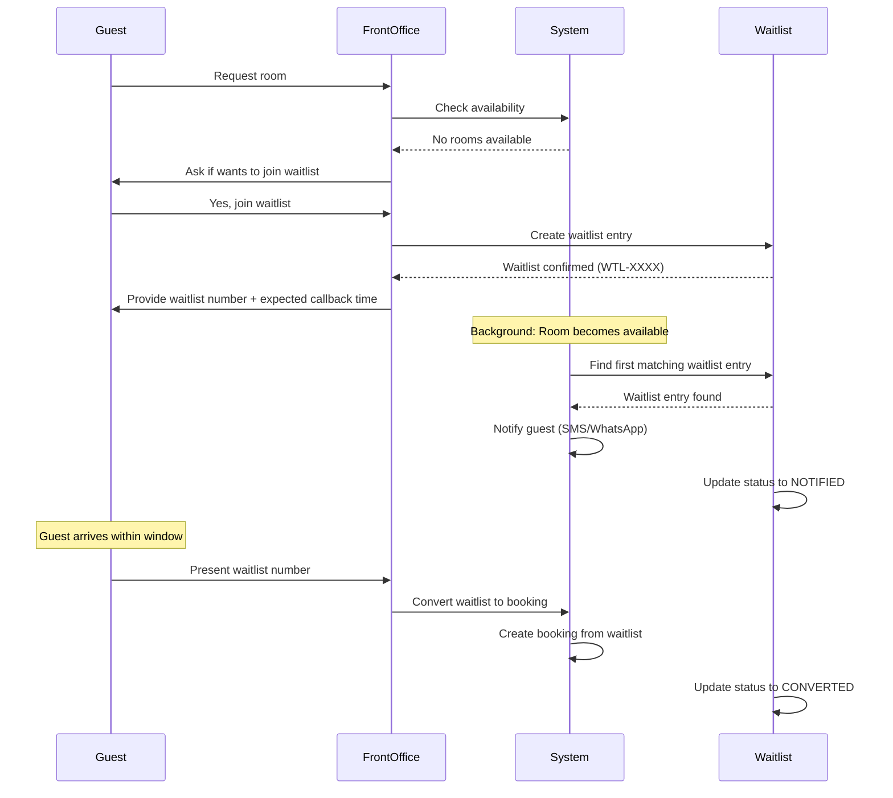
```mermaid
sequenceDiagram
    participant Guest
    participant FrontOffice
    participant System
    participant Waitlist
    
    Guest->>FrontOffice: Request room
    FrontOffice->>System: Check availability
    System-->>FrontOffice: No rooms available
    
    FrontOffice->>Guest: Ask if wants to join waitlist
    Guest->>FrontOffice: Yes, join waitlist
    
    FrontOffice->>Waitlist: Create waitlist entry
    Waitlist-->>FrontOffice: Waitlist confirmed (WTL-XXXX)
    
    FrontOffice->>Guest: Provide waitlist number + expected callback time
    
    Note over System: Background: Room becomes available
    System->>Waitlist: Find first matching waitlist entry
    Waitlist-->>System: Waitlist entry found
    
    System->>System: Notify guest (SMS/WhatsApp)
    Waitlist->>Waitlist: Update status to NOTIFIED
    
    Note over Guest: Guest arrives within window
    Guest->>FrontOffice: Present waitlist number
    FrontOffice->>System: Convert waitlist to booking
    System->>System: Create booking from waitlist
    Waitlist->>Waitlist: Update status to CONVERTED
```

**Implementation:**
```typescript
// packages/db/src/queries/waitlistQueries.ts

export async function createWaitlistEntry(data: {
  guestName: string;
  guestPhone: string;
  guestEmail?: string;
  roomType: RoomType;
  checkIn: Date;
  checkOut: Date;
  guestsCount?: number;
  priority?: number;
  propertyId?: string;
}) {
  return prisma.$transaction(async (tx) => {
    // Generate waitlist number
    const waitlistNumber = await generateWaitlistNumber(tx);
    
    // Create waitlist entry
    const entry = await tx.waitlist.create({
      data: {
        waitlistNumber,
        propertyId: data.propertyId || 'default',
        guestName: data.guestName,
        guestPhone: data.guestPhone,
        guestEmail: data.guestEmail,
        roomType: data.roomType,
        checkIn: data.checkIn,
        checkOut: data.checkOut,
        guestsCount: data.guestsCount || 1,
        priority: data.priority || 0,
        status: 'WAITING',
        expiresAt: new Date(Date.now() + 24 * 60 * 60 * 1000), // 24 hours
      }
    });
    
    // Create audit log
    await tx.auditLog.create({
      data: {
        action: 'CREATE',
        entity: 'waitlist',
        entityId: entry.id,
        metadata: { roomType: data.roomType, checkIn: data.checkIn }
      }
    });
    
    return entry;
  });
}

export async function processWaitlistForRoom(
  roomId: string,
  checkIn: Date,
  checkOut: Date,
  roomType: RoomType
) {
  // Find first matching waitlist entry
  const entry = await prisma.waitlist.findFirst({
    where: {
      roomType,
      checkIn: { lte: checkIn },
      checkOut: { gte: checkOut },
      status: 'WAITING',
      expiresAt: { gt: new Date() },
    },
    orderBy: [
      { priority: 'desc' },
      { createdAt: 'asc' }
    ]
  });
  
  if (!entry) {
    return null;
  }
  
  // Update waitlist status
  await prisma.waitlist.update({
    where: { id: entry.id },
    data: {
      status: 'NOTIFIED',
      notifiedAt: new Date(),
    }
  });
  
  // Send notification (via email/SMS service)
  await sendWaitlistNotification(entry);
  
  return entry;
}
```

### 5.3 Advance Booking with Partial Payment

**Flow:**
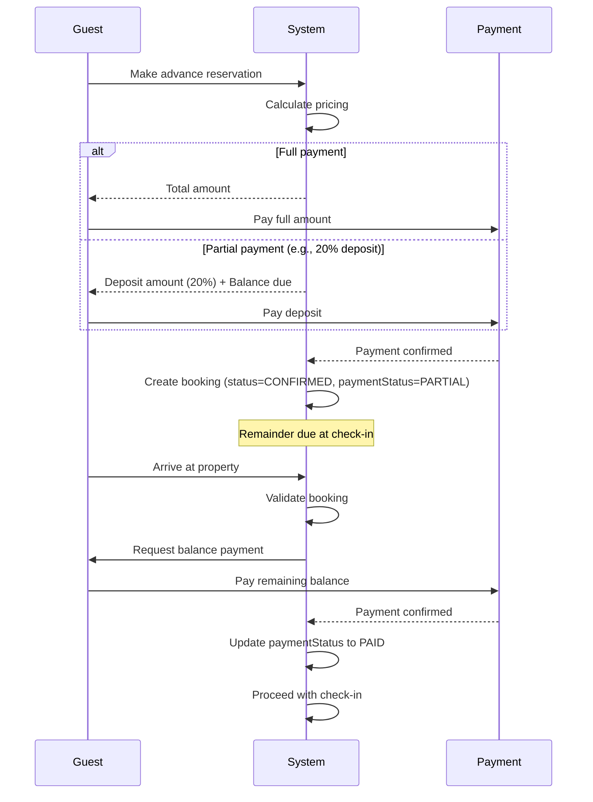
```mermaid
sequenceDiagram
    participant Guest
    participant System
    participant Payment
    
    Guest->>System: Make advance reservation
    System->>System: Calculate pricing
    
    alt Full payment
        System-->>Guest: Total amount
        Guest->>Payment: Pay full amount
    else Partial payment (e.g., 20% deposit)
        System-->>Guest: Deposit amount (20%) + Balance due
        Guest->>Payment: Pay deposit
    end
    
    Payment-->>System: Payment confirmed
    System->>System: Create booking (status=CONFIRMED, paymentStatus=PARTIAL)
    
    Note over System: Remainder due at check-in
    
    Guest->>System: Arrive at property
    System->>System: Validate booking
    System->>Guest: Request balance payment
    Guest->>Payment: Pay remaining balance
    Payment-->>System: Payment confirmed
    System->>System: Update paymentStatus to PAID
    System->>System: Proceed with check-in
```

**Implementation:**
```typescript
// packages/db/src/queries/bookingQueries.ts

export async function createAdvanceBooking(data: {
  guestId: string;
  roomType: RoomType;
  checkIn: Date;
  checkOut: Date;
  guestsCount: number;
  bookingType: 'DAILY' | 'MONTHLY';
  paymentType: 'FULL' | 'PARTIAL';
  partialAmount?: number;  // If PARTIAL
  discountCode?: string;
  specialRequests?: string;
  createdById?: string;
}) {
  return prisma.$transaction(async (tx) => {
    // 1. Get guest
    const guest = await tx.guest.findUnique({
      where: { id: data.guestId }
    });
    if (!guest) throw new Error('GUEST_NOT_FOUND');
    
    // 2. Check if blacklisted
    if (guest.isBlacklisted) {
      throw new Error('GUEST_BLACKLISTED');
    }
    
    // 3. Find available room
    const availableRoom = await findBestAvailableRoom(tx, {
      roomType: data.roomType,
      checkIn: data.checkIn,
      checkOut: data.checkOut,
    });
    
    if (!availableRoom) {
      throw new Error('NO_ROOM_AVAILABLE');
    }
    
    // 4. Calculate price
    const pricing = await calculateBookingPrice(
      availableRoom.id,
      data.checkIn,
      data.checkOut,
      data.guestsCount,
      data.bookingType,
      data.discountCode
    );
    
    // 5. Generate booking number
    const bookingNumber = await generateBookingNumber(tx);
    
    // 6. Determine payment amount
    const totalAmount = pricing.totalAmount.toNumber();
    const depositAmount = data.paymentType === 'PARTIAL'
      ? (data.partialAmount || Math.ceil(totalAmount * 0.2))  // Default 20%
      : totalAmount;
    
    // 7. Create booking
    const booking = await tx.booking.create({
      data: {
        bookingNumber,
        guestId: guest.id,
        roomId: availableRoom.id,
        checkIn: data.checkIn,
        checkOut: data.checkOut,
        guestsCount: data.guestsCount,
        bookingType: data.bookingType,
        bookingSource: 'WEBSITE',
        status: 'CONFIRMED',
        paymentStatus: depositAmount >= totalAmount ? 'PAID' : 'PARTIAL',
        baseAmount: pricing.baseAmount,
        discountAmount: pricing.discountAmount,
        totalAmount: pricing.totalAmount,
        discountCode: data.discountCode,
        specialRequests: data.specialRequests,
        roomAssignmentType: 'AUTO_ASSIGN',  // Auto-assign at check-in
        createdById: data.createdById,
      }
    });
    
    // 8. Create room hold (shorter hold for advance booking)
    await tx.roomHold.create({
      data: {
        roomId: availableRoom.id,
        holdType: 'BOOKING',
        bookingId: booking.id,
        checkIn: data.checkIn,
        checkOut: data.checkOut,
        expiresAt: new Date(data.checkIn.getTime() - 4 * 60 * 60 * 1000), // Release 4 hrs before check-in
        status: 'ACTIVE',
      }
    });
    
    // 9. Create advance deposit record
    if (depositAmount > 0) {
      const payment = await tx.payment.create({
        data: {
          bookingId: booking.id,
          amount: new Decimal(depositAmount),
          method: 'ONLINE',  // Default for advance bookings
          status: 'PAID',
        }
      });
      
      // Create advance deposit
      await tx.advanceDeposit.create({
        data: {
          bookingId: booking.id,
          amount: new Decimal(depositAmount),
          paymentId: payment.id,
          status: 'HELD',
        }
      });
    }
    
    return booking;
  });
}
```

### 5.4 Booking Without Payment (Corporate/Credit Booking)

**Flow:**
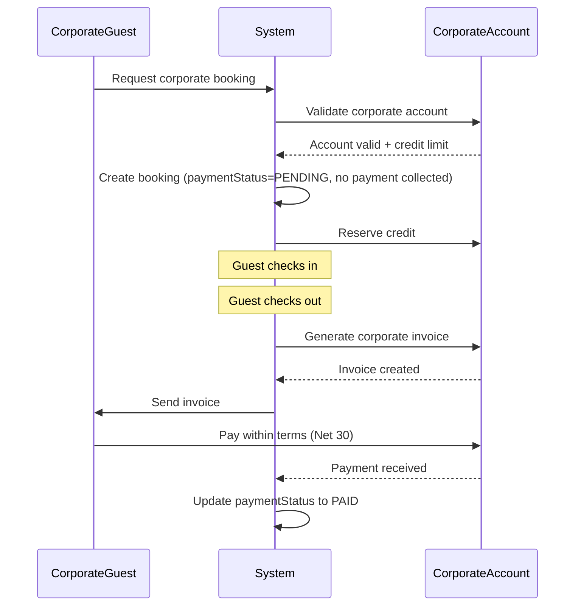
```mermaid
sequenceDiagram
    participant CorporateGuest
    participant System
    participant CorporateAccount
    
    CorporateGuest->>System: Request corporate booking
    System->>CorporateAccount: Validate corporate account
    CorporateAccount-->>System: Account valid + credit limit
    
    System->>System: Create booking (paymentStatus=PENDING, no payment collected)
    System->>CorporateAccount: Reserve credit
    
    Note over System: Guest checks in
    
    Note over System: Guest checks out
    
    System->>CorporateAccount: Generate corporate invoice
    CorporateAccount-->>System: Invoice created
    
    System->>CorporateGuest: Send invoice
    CorporateGuest->>CorporateAccount: Pay within terms (Net 30)
    CorporateAccount-->>System: Payment received
    System->>System: Update paymentStatus to PAID
```

**Implementation:**
```typescript
// Corporate booking without immediate payment

export async function createCorporateBooking(data: {
  guestId: string;
  corporateAccountId: string;
  roomType: RoomType;
  checkIn: Date;
  checkOut: Date;
  guestsCount: number;
  bookingType: 'DAILY' | 'MONTHLY';
  specialRequests?: string;
  createdById?: string;
}) {
  return prisma.$transaction(async (tx) => {
    // 1. Validate corporate account
    const corporateAccount = await tx.corporateAccount.findUnique({
      where: { id: data.corporateAccountId }
    });
    
    if (!corporateAccount || !corporateAccount.isActive) {
      throw new Error('INVALID_CORPORATE_ACCOUNT');
    }
    
    // 2. Check credit limit
    const availableRoom = await findBestAvailableRoom(tx, {
      roomType: data.roomType,
      checkIn: data.checkIn,
      checkOut: data.checkOut,
    });
    
    if (!availableRoom) {
      throw new Error('NO_ROOM_AVAILABLE');
    }
    
    // 3. Calculate price
    const pricing = await calculateBookingPrice(
      availableRoom.id,
      data.checkIn,
      data.checkOut,
      data.guestsCount,
      data.bookingType,
    );
    
    // 4. Apply corporate discount if available
    let finalAmount = pricing.totalAmount;
    if (corporateAccount.discountPercent) {
      const discount = finalAmount.mul(corporateAccount.discountPercent.toNumber() / 100);
      finalAmount = finalAmount.sub(discount);
    }
    
    // 5. Check credit limit
    if (corporateAccount.creditLimit) {
      const currentUsage = await getCorporateCreditUsage(tx, data.corporateAccountId);
      if (currentUsage.add(finalAmount).gt(corporateAccount.creditLimit)) {
        throw new Error('CREDIT_LIMIT_EXCEEDED');
      }
    }
    
    // 6. Generate booking number
    const bookingNumber = await generateBookingNumber(tx);
    
    // 7. Create booking without payment
    const booking = await tx.booking.create({
      data: {
        bookingNumber,
        guestId: data.guestId,
        roomId: availableRoom.id,
        checkIn: data.checkIn,
        checkOut: data.checkOut,
        guestsCount: data.guestsCount,
        bookingType: data.bookingType,
        bookingSource: 'CORPORATE',
        status: 'CONFIRMED',
        paymentStatus: 'PENDING',  // No payment collected
        baseAmount: pricing.baseAmount,
        discountAmount: pricing.discountAmount,
        totalAmount: finalAmount,
        specialRequests: data.specialRequests,
        corporateAccountId: data.corporateAccountId,
        roomAssignmentType: 'AUTO_ASSIGN',
        createdById: data.createdById,
      }
    });
    
    // 8. Create room hold
    await tx.roomHold.create({
      data: {
        roomId: availableRoom.id,
        holdType: 'BOOKING',
        bookingId: booking.id,
        checkIn: data.checkIn,
        checkOut: data.checkOut,
        expiresAt: new Date(data.checkIn.getTime() - 4 * 60 * 60 * 1000),
        status: 'ACTIVE',
      }
    });
    
    return booking;
  });
}
```

### 5.5 OTA Booking Auto-Sync (Booking.com, Agoda, etc.)

**Flow:**
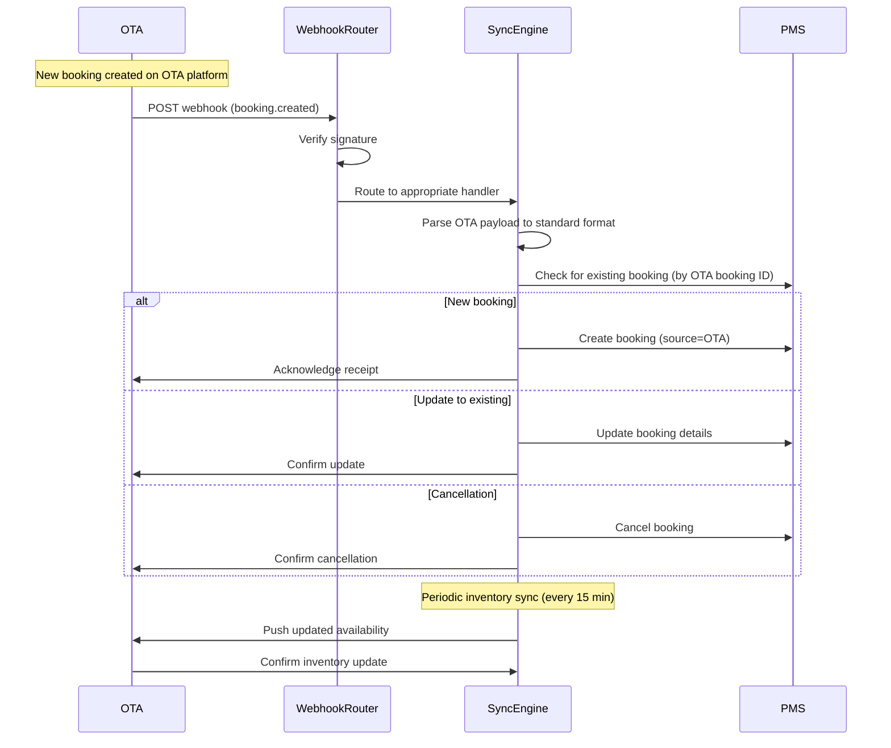
```mermaid
sequenceDiagram
    participant OTA
    participant WebhookRouter
    participant SyncEngine
    participant PMS
    
    Note over OTA: New booking created on OTA platform
    
    OTA->>WebhookRouter: POST webhook (booking.created)
    WebhookRouter->>WebhookRouter: Verify signature
    WebhookRouter->>SyncEngine: Route to appropriate handler
    
    SyncEngine->>SyncEngine: Parse OTA payload to standard format
    SyncEngine->>PMS: Check for existing booking (by OTA booking ID)
    
    alt New booking
        SyncEngine->>PMS: Create booking (source=OTA)
        SyncEngine->>OTA: Acknowledge receipt
    else Update to existing
        SyncEngine->>PMS: Update booking details
        SyncEngine->>OTA: Confirm update
    else Cancellation
        SyncEngine->>PMS: Cancel booking
        SyncEngine->>OTA: Confirm cancellation
    end
    
    Note over SyncEngine: Periodic inventory sync (every 15 min)
    SyncEngine->>OTA: Push updated availability
    OTA->>SyncEngine: Confirm inventory update
```

**Implementation:**
```typescript
// packages/channel-manager/src/webhooks/BookingWebhookHandler.ts

export class BookingWebhookHandler {
  async handleBookingCreated(channelName: ChannelName, payload: any): Promise<BookingResult> {
    return prisma.$transaction(async (tx) => {
      // 1. Parse and normalize OTA booking data
      const otaBooking = this.parseOtaBooking(channelName, payload);
      
      // 2. Check for existing mapping
      const existingMapping = await tx.otaBookingMapping.findFirst({
        where: {
          channelBookingId: otaBooking.otaBookingId,
        }
      });
      
      if (existingMapping) {
        // Update existing booking
        const booking = await tx.booking.update({
          where: { id: existingMapping.bookingId },
          data: {
            checkIn: otaBooking.checkIn,
            checkOut: otaBooking.checkOut,
            guestsCount: otaBooking.guestsCount,
            specialRequests: otaBooking.specialRequests,
          }
        });
        
        // Update mapping sync status
        await tx.otaBookingMapping.update({
          where: { id: existingMapping.id },
          data: { lastSyncAt: new Date(), syncStatus: 'SYNCED' }
        });
        
        return { action: 'UPDATED', bookingId: booking.id };
      }
      
      // 3. Create new booking
      // Find or create guest
      let guest = await tx.guest.findFirst({
        where: { email: otaBooking.guestEmail }
      });
      
      if (!guest) {
        guest = await tx.guest.create({
          data: {
            name: otaBooking.guestName,
            phone: otaBooking.guestPhone,
            email: otaBooking.guestEmail,
          }
        });
      }
      
      // Find available room of required type
      const availableRoom = await findBestAvailableRoom(tx, {
        roomType: this.mapOtaRoomType(otaBooking.roomTypeId),
        checkIn: otaBooking.checkIn,
        checkOut: otaBooking.checkOut,
      });
      
      if (!availableRoom) {
        // Log overbooking issue
        await this.handleOverbooking(tx, otaBooking);
        throw new Error('NO_ROOM_AVAILABLE_FOR_OTA');
      }
      
      // Generate booking number
      const bookingNumber = await generateBookingNumber(tx);
      
      // Create booking
      const booking = await tx.booking.create({
        data: {
          bookingNumber,
          guestId: guest.id,
          roomId: availableRoom.id,
          checkIn: otaBooking.checkIn,
          checkOut: otaBooking.checkOut,
          guestsCount: otaBooking.guestsCount || 1,
          bookingType: this.determineBookingType(otaBooking.checkIn, otaBooking.checkOut),
          bookingSource: 'OTA',
          status: 'CONFIRMED',
          paymentStatus: 'PAID',  // OTA usually prepays
          totalAmount: new Decimal(otaBooking.totalAmount),
          specialRequests: otaBooking.specialRequests,
          roomAssignmentType: 'PRE_ASSIGNED',
        }
      });
      
      // Create OTA mapping
      const channel = await tx.channel.findUnique({
        where: { name: channelName }
      });
      
      await tx.otaBookingMapping.create({
        data: {
          bookingId: booking.id,
          bookingNumber: booking.bookingNumber,
          channelId: channel.id,
          channelBookingId: otaBooking.otaBookingId,
          channelBookingRef: otaBooking.otaReference,
          lastSyncAt: new Date(),
          syncStatus: 'SYNCED',
        }
      });
      
      return { action: 'CREATED', bookingId: booking.id };
    });
  }
  
  async handleBookingCancelled(channelName: ChannelName, otaBookingId: string, reason: string) {
    return prisma.$transaction(async (tx) => {
      // Find OTA mapping
      const mapping = await tx.otaBookingMapping.findFirst({
        where: { channelBookingId: otaBookingId }
      });
      
      if (!mapping) {
        throw new Error('OTA_BOOKING_NOT_FOUND');
      }
      
      // Cancel booking
      await tx.booking.update({
        where: { id: mapping.bookingId },
        data: { status: 'CANCELLED' }
      });
      
      // Release room
      await tx.roomHold.updateMany({
        where: { bookingId: mapping.bookingId },
        data: { status: 'RELEASED' }
      });
      
      // Update mapping
      await tx.otaBookingMapping.update({
        where: { id: mapping.id },
        data: { syncStatus: 'PENDING_CANCEL' }
      });
      
      return { action: 'CANCELLED', bookingId: mapping.bookingId };
    });
  }
}
```

### 5.6 Duplicate Booking Detection

**Flow:**
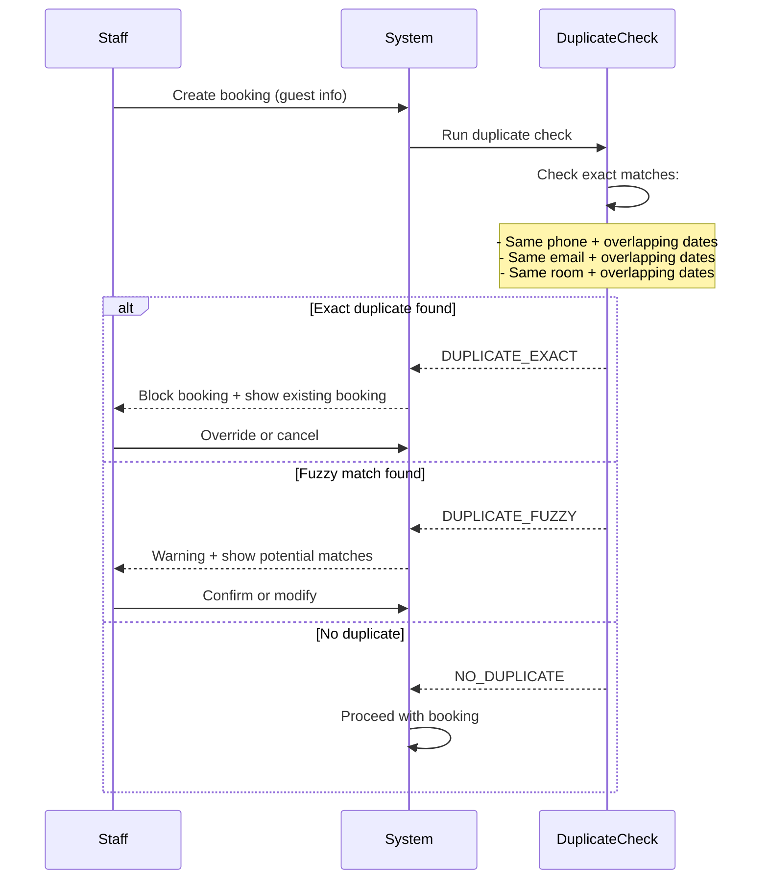
```mermaid
sequenceDiagram
    participant Staff
    participant System
    participant DuplicateCheck
    
    Staff->>System: Create booking (guest info)
    System->>DuplicateCheck: Run duplicate check
    
    DuplicateCheck->>DuplicateCheck: Check exact matches:
    Note over DuplicateCheck: - Same phone + overlapping dates<br/>- Same email + overlapping dates<br/>- Same room + overlapping dates
    
    alt Exact duplicate found
        DuplicateCheck-->>System: DUPLICATE_EXACT
        System-->>Staff: Block booking + show existing booking
        Staff->>System: Override or cancel
    else Fuzzy match found
        DuplicateCheck-->>System: DUPLICATE_FUZZY
        System-->>Staff: Warning + show potential matches
        Staff->>System: Confirm or modify
    else No duplicate
        DuplicateCheck-->>System: NO_DUPLICATE
        System->>System: Proceed with booking
    end
```

**Implementation:**
```typescript
// packages/db/src/validators.ts

export interface DuplicateCheckResult {
  isDuplicate: boolean;
  matchType: DuplicateMatchType | null;
  confidence: number;  // 0-100
  existingBookings: {
    bookingId: string;
    bookingNumber: string;
    checkIn: Date;
    checkOut: Date;
    room: { roomNumber: string; type: RoomType };
    guest: { name: string; phone: string; email?: string };
  }[];
}

export async function checkDuplicateBooking(
  tx: Prisma.TransactionClient,
  params: {
    guestId?: string;
    guestPhone?: string;
    guestEmail?: string;
    guestName?: string;
    checkIn: Date;
    checkOut: Date;
    roomType?: RoomType;
    excludeBookingId?: string;
  }
): Promise<DuplicateCheckResult> {
  const matches: DuplicateCheckResult['existingBookings'] = [];
  let matchType: DuplicateMatchType | null = null;
  let confidence = 0;
  
  // 1. Exact phone + date overlap check
  if (params.guestPhone) {
    const phoneMatches = await tx.booking.findMany({
      where: {
        guest: { phone: params.guestPhone },
        id: params.excludeBookingId ? { not: params.excludeBookingId } : undefined,
        status: { in: ['CONFIRMED', 'CHECKED_IN'] },
        OR: [
          // New check-in during existing booking
          {
            checkIn: { lte: params.checkIn },
            checkOut: { gt: params.checkIn }
          },
          // New check-out during existing booking
          {
            checkIn: { lt: params.checkOut },
            checkOut: { gte: params.checkOut }
          },
          // New booking contains existing
          {
            checkIn: { gte: params.checkIn },
            checkOut: { lte: params.checkOut }
          }
        ]
      },
      include: {
        guest: { select: { name: true, phone: true, email: true } },
        room: { select: { roomNumber: true, type: true } }
      }
    });
    
    if (phoneMatches.length > 0) {
      matchType = 'EXACT_PHONE';
      confidence = 100;
      matches.push(...phoneMatches.map(b => ({
        bookingId: b.id,
        bookingNumber: b.bookingNumber,
        checkIn: b.checkIn,
        checkOut: b.checkOut,
        room: b.room,
        guest: b.guest
      })));
    }
  }
  
  // 2. Exact email + date overlap check
  if (params.guestEmail && confidence < 100) {
    const emailMatches = await tx.booking.findMany({
      where: {
        guest: { email: params.guestEmail },
        id: params.excludeBookingId ? { not: params.excludeBookingId } : undefined,
        status: { in: ['CONFIRMED', 'CHECKED_IN'] },
        // Same date overlap logic
      },
      include: {
        guest: { select: { name: true, phone: true, email: true } },
        room: { select: { roomNumber: true, type: true } }
      }
    });
    
    if (emailMatches.length > 0) {
      matchType = 'EXACT_EMAIL';
      confidence = 100;
      // Add to matches if not already there
    }
  }
  
  // 3. Same room + date overlap check
  if (params.roomType && confidence < 100) {
    const roomMatches = await tx.booking.findMany({
      where: {
        room: { type: params.roomType },
        id: params.excludeBookingId ? { not: params.excludeBookingId } : undefined,
        status: { in: ['CONFIRMED', 'CHECKED_IN'] },
        // Same date overlap logic
      },
      include: {
        guest: { select: { name: true, phone: true, email: true } },
        room: { select: { roomNumber: true, type: true } }
      }
    });
    
    if (roomMatches.length > 0) {
      matchType = 'EXACT_DATES_ROOM';
      confidence = 90;
    }
  }
  
  // 4. Fuzzy name matching (if enabled)
  if (params.guestName && confidence < 100) {
    const fuzzyMatches = await tx.booking.findMany({
      where: {
        guest: {
          name: {
            // Use similarity function or ILIKE for fuzzy match
            contains: params.guestName.substring(0, 3)  // First 3 chars
          }
        },
        id: params.excludeBookingId ? { not: params.excludeBookingId } : undefined,
        status: { in: ['CONFIRMED', 'CHECKED_IN'] },
        // Date overlap
      },
      include: {
        guest: { select: { name: true, phone: true, email: true } },
        room: { select: { roomNumber: true, type: true } }
      }
    });
    
    if (fuzzyMatches.length > 0) {
      matchType = 'FUZZY_NAME';
      confidence = 60;
    }
  }
  
  return {
    isDuplicate: confidence >= 90,
    matchType,
    confidence,
    existingBookings: matches
  };
}
```

### 5.7 Early Check-in Request Handling

**Flow:**
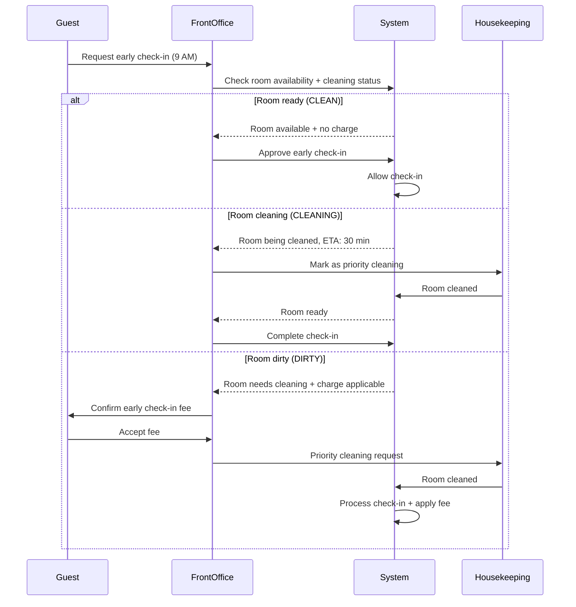
```mermaid
sequenceDiagram
    participant Guest
    participant FrontOffice
    participant System
    participant Housekeeping
    
    Guest->>FrontOffice: Request early check-in (9 AM)
    FrontOffice->>System: Check room availability + cleaning status
    
    alt Room ready (CLEAN)
        System-->>FrontOffice: Room available + no charge
        FrontOffice->>System: Approve early check-in
        System->>System: Allow check-in
    else Room cleaning (CLEANING)
        System-->>FrontOffice: Room being cleaned, ETA: 30 min
        FrontOffice->>Housekeeping: Mark as priority cleaning
        Housekeeping->>System: Room cleaned
        System-->>FrontOffice: Room ready
        FrontOffice->>System: Complete check-in
    else Room dirty (DIRTY)
        System-->>FrontOffice: Room needs cleaning + charge applicable
        FrontOffice->>Guest: Confirm early check-in fee
        Guest->>FrontOffice: Accept fee
        FrontOffice->>Housekeeping: Priority cleaning request
        Housekeeping->>System: Room cleaned
        System->>System: Process check-in + apply fee
    end
```

**Implementation:**
```typescript
// packages/db/src/queries/stayModificationQueries.ts

export async function requestEarlyCheckin(
  bookingId: string,
  requestedTime: Date,
  reason?: string
) {
  return prisma.$transaction(async (tx) => {
    // 1. Get booking details
    const booking = await tx.booking.findUnique({
      where: { id: bookingId },
      include: {
        room: true,
        property: true
      }
    });
    
    if (!booking) throw new Error('BOOKING_NOT_FOUND');
    if (booking.status !== 'CONFIRMED') {
      throw new Error('BOOKING_NOT_CONFIRMED');
    }
    
    // 2. Get hotel settings
    const settings = await tx.hotelSettings.findUnique({
      where: { id: booking.propertyId }
    });
    
    // 3. Calculate if early check-in is applicable
    const checkInHour = settings.checkInTime 
      ? parseInt(settings.checkInTime.split(':')[0]) 
      : 14;  // Default 2 PM
      
    const requestedHour = requestedTime.getHours();
    const isEarly = requestedHour < checkInHour;
    
    if (!isEarly) {
      // Not early check-in, just regular check-in
      return { type: 'REGULAR', noCharge: true };
    }
    
    // 4. Check room status
    const room = await tx.room.findUnique({
      where: { id: booking.roomId }
    });
    
    if (room.cleaningStatus === 'CLEAN') {
      // Room ready, no charge if within free early window
      const freeEarlyHour = settings.earlyCheckinCutoffHour || 10;
      
      if (requestedHour < freeEarlyHour) {
        return { 
          type: 'EARLY', 
          noCharge: true,
          canCheckIn: true 
        };
      }
      
      // Apply early check-in fee
      const fee = calculateEarlyCheckinFee(settings, requestedHour);
      return {
        type: 'EARLY',
        noCharge: false,
        fee,
        canCheckIn: true
      };
    }
    
    // 5. Room not ready - create stay modification request
    const extraCharge = calculateEarlyCheckinFee(settings, requestedHour);
    
    const request = await tx.stayModificationRequest.create({
      data: {
        bookingId: booking.id,
        type: 'EARLY_CHECKIN',
        status: 'PENDING',
        originalCheckIn: booking.checkIn,
        originalCheckOut: booking.checkOut,
        requestedCheckIn: requestedTime,
        reason,
        extraChargeAmount: extraCharge,
        chargeDescription: `Early check-in before ${checkInHour}:00`,
      }
    });
    
    // 6. Mark room for priority cleaning if needed
    if (room.cleaningStatus === 'DIRTY' || room.cleaningStatus === 'CLEANING') {
      await tx.room.update({
        where: { id: booking.roomId },
        data: {
          isPriorityCleaning: true,
          priorityReason: `Early check-in requested at ${requestedTime.toISOString()}`
        }
      });
    }
    
    return {
      type: 'EARLY',
      noCharge: false,
      fee: extraCharge,
      canCheckIn: false,
      requestId: request.id,
      message: 'Room being prepared, you will be notified when ready'
    };
  });
}

function calculateEarlyCheckinFee(settings: HotelSettings, requestedHour: number): Decimal {
  const baseHour = settings.earlyCheckinCutoffHour || 10;
  const hoursEarly = baseHour - requestedHour;
  
  if (settings.earlyCheckinChargeType === 'HALF_DAY') {
    // Half day rate
    const halfDayRate = settings.earlyCheckInFee || new Decimal(500);
    return halfDayRate;
  } else if (settings.earlyCheckinChargeType === 'HOURLY') {
    // Hourly rate
    const hourlyRate = (settings.earlyCheckInFee?.toNumber() || 100) * hoursEarly;
    return new Decimal(hourlyRate);
  }
  
  // Full day
  return settings.earlyCheckInFee || new Decimal(1000);
}
```

### 5.8 Late Arrival (After Midnight) Check-in

**Flow:**
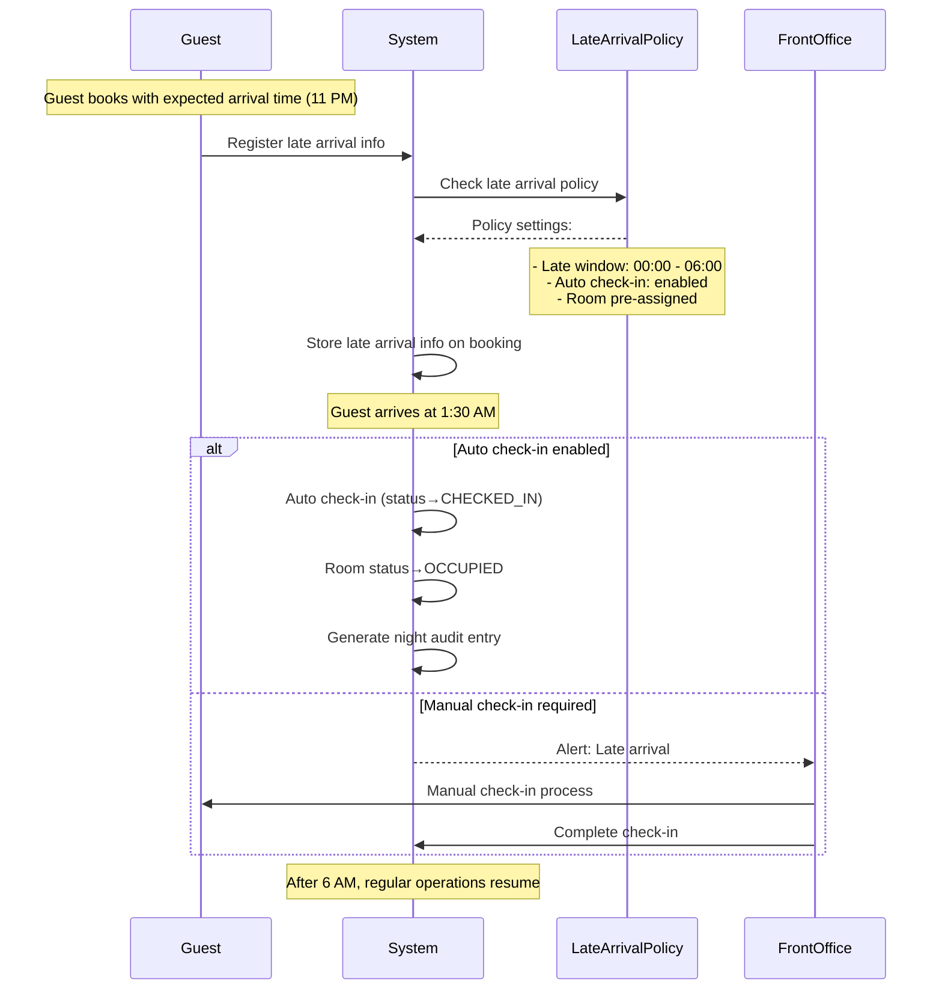
```mermaid
sequenceDiagram
    participant Guest
    participant System
    participant LateArrivalPolicy
    
    Note over Guest: Guest books with expected arrival time (11 PM)
    
    Guest->>System: Register late arrival info
    System->>LateArrivalPolicy: Check late arrival policy
    
    LateArrivalPolicy-->>System: Policy settings:
    Note over LateArrivalPolicy: - Late window: 00:00 - 06:00<br/>- Auto check-in: enabled<br/>- Room pre-assigned
    
    System->>System: Store late arrival info on booking
    
    Note over System: Guest arrives at 1:30 AM
    
    alt Auto check-in enabled
        System->>System: Auto check-in (status→CHECKED_IN)
        System->>System: Room status→OCCUPIED
        System->>System: Generate night audit entry
    else Manual check-in required
        System-->>FrontOffice: Alert: Late arrival
        FrontOffice->>Guest: Manual check-in process
        FrontOffice->>System: Complete check-in
    end
    
    Note over System: After 6 AM, regular operations resume
```

**Implementation:**
```typescript
// packages/db/src/queries/bookingQueries.ts

export async function processLateArrivalCheckin(
  bookingId: string,
  params: {
    actualCheckInTime: Date;
    initiatedById?: string;
    skipAutoCheckIn?: boolean;  // Force manual check-in
  }
) {
  return prisma.$transaction(async (tx) => {
    // 1. Get booking
    const booking = await tx.booking.findUnique({
      where: { id: bookingId },
      include: {
        room: true,
        property: true
      }
    });
    
    if (!booking) throw new Error('BOOKING_NOT_FOUND');
    
    // 2. Get late arrival policy
    const policy = await tx.lateArrivalPolicy.findUnique({
      where: { propertyId: booking.propertyId }
    }) || getDefaultLateArrivalPolicy();
    
    // 3. Check if arrival is in late window
    const hour = params.actualCheckInTime.getHours();
    const isLateArrival = hour >= policy.lateArrivalStartHour && 
                          hour < policy.lateArrivalEndHour;
    
    if (!isLateArrival) {
      // Regular check-in
      return processRegularCheckin(tx, bookingId, params.initiatedById);
    }
    
    // 4. Check if auto check-in is allowed
    if (policy.autoCheckInEnabled && !params.skipAutoCheckIn) {
      // Verify conditions for auto check-in
      const roomReady = booking.room.cleaningStatus === 'CLEAN' &&
                       booking.room.status === 'VACANT';
      
      if (roomReady && policy.allowAutoRoomAssignment) {
        // Auto check-in
        await tx.booking.update({
          where: { id: bookingId },
          data: {
            status: 'CHECKED_IN',
            checkInTime: params.actualCheckInTime,
          }
        });
        
        await tx.room.update({
          where: { id: booking.roomId },
          data: { status: 'OCCUPIED' }
        });
        
        // Create audit log
        await tx.auditLog.create({
          data: {
            bookingId,
            action: 'AUTO_CHECKIN_LATE',
            entity: 'booking',
            entityId: bookingId,
            userId: params.initiatedById,
            metadata: {
              actualCheckInTime: params.actualCheckInTime,
              autoCheckIn: true,
              lateArrivalWindow: `${policy.lateArrivalStartHour}:00 - ${policy.lateArrivalEndHour}:00`
            }
          }
        });
        
        return {
          success: true,
          autoCheckIn: true,
          message: 'Auto check-in completed for late arrival'
        };
      }
    }
    
    // 5. Manual check-in required
    // Alert front office
    return {
      success: false,
      autoCheckIn: false,
      requiresManualCheckIn: true,
      message: `Late arrival requires manual check-in. Arrival time: ${params.actualCheckInTime.toLocaleTimeString()}`,
      lateArrivalInfo: {
        windowStart: `${policy.lateArrivalStartHour}:00`,
        windowEnd: `${policy.lateArrivalEndHour}:00`,
        guestExpectedTime: booking.lateArrivalInfo?.expectedTime
      }
    };
  });
}
```

### 5.9 Group Booking with Multiple Rooms

**Flow:**
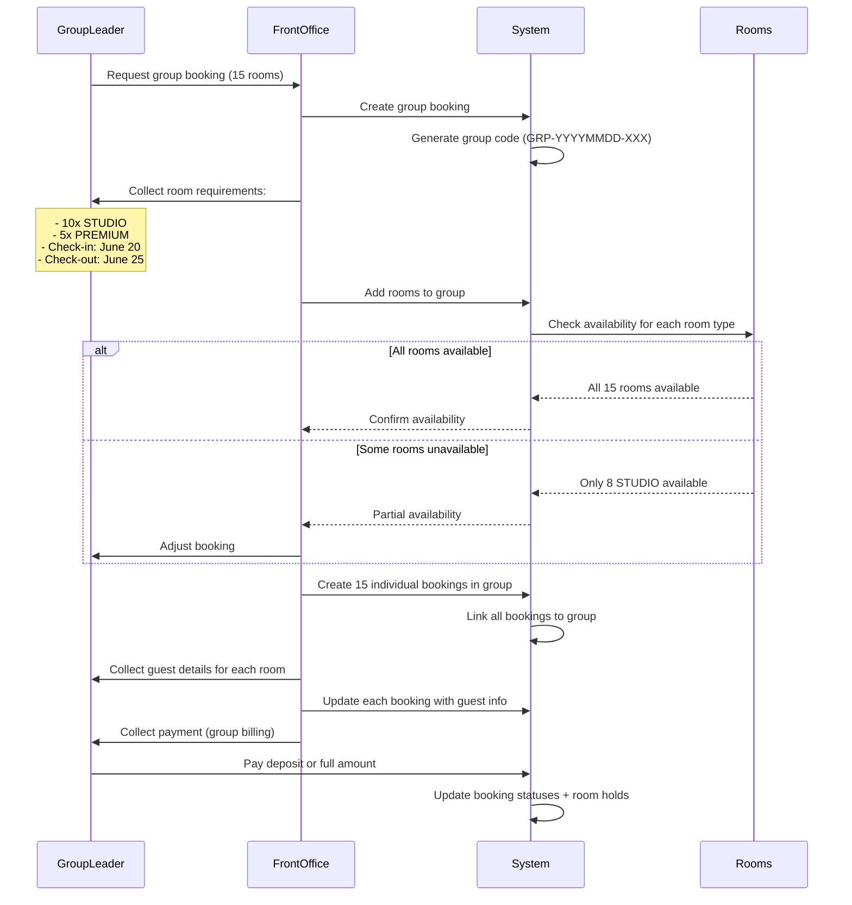
```mermaid
sequenceDiagram
    participant GroupLeader
    participant FrontOffice
    participant System
    participant Rooms
    
    GroupLeader->>FrontOffice: Request group booking (15 rooms)
    FrontOffice->>System: Create group booking
    
    System->>System: Generate group code (GRP-YYYYMMDD-XXX)
    
    FrontOffice->>GroupLeader: Collect room requirements:
    Note over GroupLeader: - 10x STUDIO<br/>- 5x PREMIUM<br/>- Check-in: June 20<br/>- Check-out: June 25
    
    FrontOffice->>System: Add rooms to group
    System->>Rooms: Check availability for each room type
    
    alt All rooms available
        Rooms-->>System: All 15 rooms available
        System-->>FrontOffice: Confirm availability
    else Some rooms unavailable
        Rooms-->>System: Only 8 STUDIO available
        System-->>FrontOffice: Partial availability
        FrontOffice->>GroupLeader: Adjust booking
    end
    
    FrontOffice->>System: Create 15 individual bookings in group
    System->>System: Link all bookings to group
    
    FrontOffice->>GroupLeader: Collect guest details for each room
    FrontOffice->>System: Update each booking with guest info
    
    FrontOffice->>GroupLeader: Collect payment (group billing)
    GroupLeader->>System: Pay deposit or full amount
    
    System->>System: Update booking statuses + room holds
```

**Implementation:**
```typescript
// packages/db/src/queries/groupBookingQueries.ts

export async function createGroupBooking(data: {
  name: string;
  contactPerson?: string;
  contactPhone?: string;
  contactEmail?: string;
  billingType: 'SHARED' | 'INDIVIDUAL' | 'MIXED';
  checkInDate: Date;
  checkOutDate: Date;
  rooms: {
    roomType: RoomType;
    count: number;
  }[];
  corporateAccountId?: string;
  createdById?: string;
  propertyId?: string;
}) {
  return prisma.$transaction(async (tx) => {
    // 1. Generate group code
    const groupCode = await generateGroupCode(tx);
    
    // 2. Create group booking
    const group = await tx.groupBooking.create({
      data: {
        groupCode,
        propertyId: data.propertyId || 'default',
        name: data.name,
        contactPerson: data.contactPerson,
        contactPhone: data.contactPhone,
        contactEmail: data.contactEmail,
        billingType: data.billingType,
        checkInDate: data.checkInDate,
        checkOutDate: data.checkOutDate,
        status: 'CONFIRMED',
        createdById: data.createdById,
      }
    });
    
    // 3. Check availability and create bookings for each room type
    const bookings = [];
    const errors = [];
    
    for (const roomReq of data.rooms) {
      // Find available rooms
      const availableRooms = await tx.room.findMany({
        where: {
          type: roomReq.roomType,
          status: 'VACANT',
          propertyId: data.propertyId || 'default',
          bookings: {
            none: {
              status: { in: ['CONFIRMED', 'CHECKED_IN'] },
              AND: [
                { checkIn: { lt: data.checkOutDate } },
                { checkOut: { gt: data.checkInDate } }
              ]
            }
          }
        },
        take: roomReq.count,
        orderBy: { roomNumber: 'asc' }
      });
      
      if (availableRooms.length < roomReq.count) {
        errors.push({
          roomType: roomReq.roomType,
          requested: roomReq.count,
          available: availableRooms.length
        });
      }
      
      // Create booking for each available room
      for (const room of availableRooms) {
        const bookingNumber = await generateBookingNumber(tx);
        
        // Calculate price
        const pricing = await calculateBookingPrice(
          room.id,
          data.checkInDate,
          data.checkOutDate,
          1,  // Default 1 guest per room
          'DAILY'
        );
        
        const booking = await tx.booking.create({
          data: {
            bookingNumber,
            guestId: (await tx.guest.create({
              data: {
                name: 'TBD',  // Will be updated later
                phone: 'TBD',
              }
            })).id,
            roomId: room.id,
            propertyId: data.propertyId || 'default',
            checkIn: data.checkInDate,
            checkOut: data.checkOutDate,
            guestsCount: 1,
            bookingType: 'DAILY',
            bookingSource: 'GROUP',
            status: 'CONFIRMED',
            paymentStatus: 'PENDING',
            baseAmount: pricing.baseAmount,
            discountAmount: pricing.discountAmount,
            totalAmount: pricing.totalAmount,
            groupBookingId: group.id,
            corporateAccountId: data.corporateAccountId,
            createdById: data.createdById,
          }
        });
        
        // Create room hold
        await tx.roomHold.create({
          data: {
            roomId: room.id,
            holdType: 'BOOKING',
            bookingId: booking.id,
            checkIn: data.checkInDate,
            checkOut: data.checkOutDate,
            expiresAt: new Date(data.checkInDate.getTime() - 4 * 60 * 60 * 1000),
            status: 'ACTIVE',
          }
        });
        
        bookings.push(booking);
      }
    }
    
    // 4. Create audit log
    await tx.auditLog.create({
      data: {
        action: 'CREATE',
        entity: 'group_booking',
        entityId: group.id,
        userId: data.createdById,
        metadata: {
          groupCode,
          roomCount: bookings.length,
          errors: errors.length > 0 ? errors : undefined
        }
      }
    });
    
    return {
      group,
      bookings,
      errors: errors.length > 0 ? errors : undefined
    };
  });
}
```

### 5.10 Split Group into Different Room Types

**Flow:**
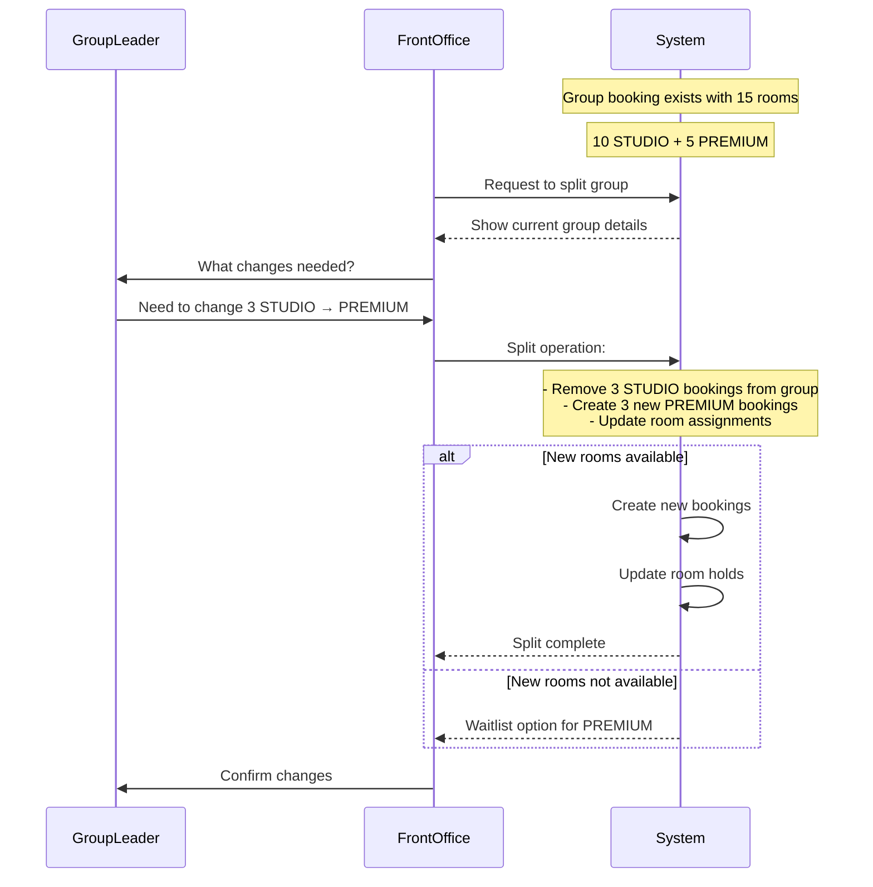
```mermaid
sequenceDiagram
    participant GroupLeader
    participant FrontOffice
    participant System
    
    Note over System: Group booking exists with 15 rooms
    Note over System: 10 STUDIO + 5 PREMIUM
    
    FrontOffice->>System: Request to split group
    System-->>FrontOffice: Show current group details
    
    FrontOffice->>GroupLeader: What changes needed?
    GroupLeader->>FrontOffice: Need to change 3 STUDIO → PREMIUM
    
    FrontOffice->>System: Split operation:
    Note over System: - Remove 3 STUDIO bookings from group<br/>- Create 3 new PREMIUM bookings<br/>- Update room assignments
    
    alt New rooms available
        System->>System: Create new bookings
        System->>System: Update room holds
        System-->>FrontOffice: Split complete
    else New rooms not available
        System-->>FrontOffice: Waitlist option for PREMIUM
    end
    
    FrontOffice->>GroupLeader: Confirm changes
```

**Implementation:**
```typescript
// packages/db/src/queries/groupBookingQueries.ts

export async function splitGroupBooking(
  groupId: string,
  operations: {
    removeRooms: { bookingIds: string[] }[];
    addRooms: { roomType: RoomType; count: number }[];
  },
  initiatedById?: string
) {
  return prisma.$transaction(async (tx) => {
    // 1. Get group booking
    const group = await tx.groupBooking.findUnique({
      where: { id: groupId },
      include: { bookings: true }
    });
    
    if (!group) throw new Error('GROUP_NOT_FOUND');
    
    const results = {
      removed: [] as string[],
      added: [] as string[],
      errors: [] as string[]
    };
    
    // 2. Process removals
    for (const op of operations.removeRooms) {
      for (const bookingId of op.bookingIds) {
        const booking = group.bookings.find(b => b.id === bookingId);
        if (!booking) {
          results.errors.push(`Booking ${bookingId} not in group`);
          continue;
        }
        
        // Remove from group
        await tx.booking.update({
          where: { id: bookingId },
          data: { groupBookingId: null }
        });
        
        // Release room hold
        await tx.roomHold.updateMany({
          where: { bookingId },
          data: { status: 'RELEASED' }
        });
        
        results.removed.push(bookingId);
      }
    }
    
    // 3. Process additions
    for (const op of operations.addRooms) {
      // Find available rooms
      const availableRooms = await tx.room.findMany({
        where: {
          type: op.roomType,
          status: 'VACANT',
          propertyId: group.propertyId,
          bookings: {
            none: {
              status: { in: ['CONFIRMED', 'CHECKED_IN'] },
              AND: [
                { checkIn: { lt: group.checkOutDate } },
                { checkOut: { gt: group.checkInDate } }
              ]
            }
          }
        },
        take: op.count
      });
      
      if (availableRooms.length < op.count) {
        results.errors.push(
          `Room type ${op.roomType}: requested ${op.count}, available ${availableRooms.length}`
        );
      }
      
      // Create new bookings
      for (const room of availableRooms) {
        const bookingNumber = await generateBookingNumber(tx);
        
        const pricing = await calculateBookingPrice(
          room.id,
          group.checkInDate,
          group.checkOutDate,
          1,
          'DAILY'
        );
        
        const booking = await tx.booking.create({
          data: {
            bookingNumber,
            guestId: (await tx.guest.create({
              data: { name: 'TBD', phone: 'TBD' }
            })).id,
            roomId: room.id,
            propertyId: group.propertyId,
            checkIn: group.checkInDate,
            checkOut: group.checkOutDate,
            guestsCount: 1,
            bookingType: 'DAILY',
            bookingSource: 'GROUP',
            status: 'CONFIRMED',
            paymentStatus: 'PENDING',
            baseAmount: pricing.baseAmount,
            discountAmount: pricing.discountAmount,
            totalAmount: pricing.totalAmount,
            groupBookingId: group.id,
            createdById: initiatedById,
          }
        });
        
        // Create room hold
        await tx.roomHold.create({
          data: {
            roomId: room.id,
            holdType: 'BOOKING',
            bookingId: booking.id,
            checkIn: group.checkInDate,
            checkOut: group.checkOutDate,
            expiresAt: new Date(group.checkInDate.getTime() - 4 * 60 * 60 * 1000),
            status: 'ACTIVE',
          }
        });
        
        results.added.push(booking.id);
      }
    }
    
    // 4. Create audit log
    await tx.auditLog.create({
      data: {
        action: 'SPLIT_GROUP',
        entity: 'group_booking',
        entityId: group.id,
        userId: initiatedById,
        metadata: {
          removedBookings: results.removed,
          addedBookings: results.added,
          errors: results.errors
        }
      }
    });
    
    return results;
  });
}
```

### 5.11 Guest Wants to Change Room Before Check-in

**Flow:**
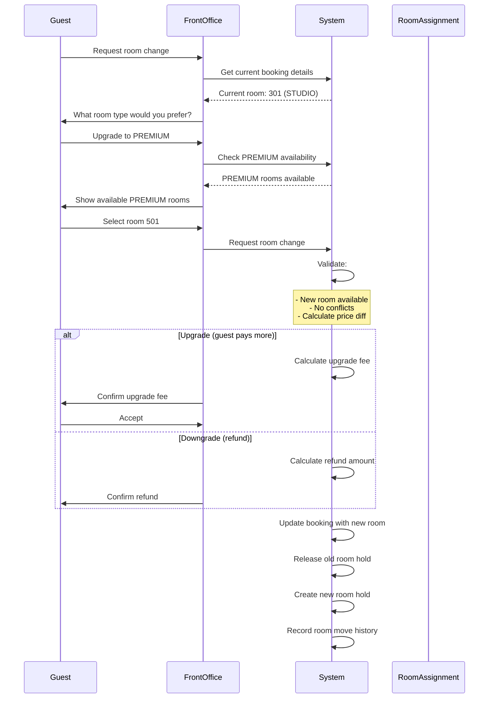
```mermaid
sequenceDiagram
    participant Guest
    participant FrontOffice
    participant System
    participant RoomAssignment
    
    Guest->>FrontOffice: Request room change
    FrontOffice->>System: Get current booking details
    
    System-->>FrontOffice: Current room: 301 (STUDIO)
    FrontOffice->>Guest: What room type would you prefer?
    Guest->>FrontOffice: Upgrade to PREMIUM
    
    FrontOffice->>System: Check PREMIUM availability
    System-->>FrontOffice: PREMIUM rooms available
    
    FrontOffice->>Guest: Show available PREMIUM rooms
    Guest->>FrontOffice: Select room 501
    
    FrontOffice->>System: Request room change
    System->>System: Validate:
    Note over System: - New room available<br/>- No conflicts<br/>- Calculate price diff
    
    alt Upgrade (guest pays more)
        System->>System: Calculate upgrade fee
        FrontOffice->>Guest: Confirm upgrade fee
        Guest->>FrontOffice: Accept
    else Downgrade (refund)
        System->>System: Calculate refund amount
        FrontOffice->>Guest: Confirm refund
    end
    
    System->>System: Update booking with new room
    System->>System: Release old room hold
    System->>System: Create new room hold
    System->>System: Record room move history
```

**Implementation:**
```typescript
// packages/db/src/queries/roomMoveQueries.ts

export async function requestRoomChange(
  bookingId: string,
  newRoomId: string,
  reason: RoomMoveReason,
  initiatedById?: string
) {
  return prisma.$transaction(async (tx) => {
    // 1. Get current booking
    const booking = await tx.booking.findUnique({
      where: { id: bookingId },
      include: {
        room: true,
        guest: true,
        payments: true
      }
    });
    
    if (!booking) throw new Error('BOOKING_NOT_FOUND');
    if (booking.status !== 'CONFIRMED') {
      throw new Error('CANNOT_CHANGE_ROOM_AFTER_CHECKIN');
    }
    
    // 2. Get new room
    const newRoom = await tx.room.findUnique({
      where: { id: newRoomId }
    });
    
    if (!newRoom) throw new Error('ROOM_NOT_FOUND');
    if (newRoom.type !== booking.room.type) {
      throw new Error('ROOM_TYPE_MISMATCH');
    }
    
    // 3. Check new room availability
    const isAvailable = await checkRoomAvailability(tx, {
      roomId: newRoomId,
      checkIn: booking.checkIn,
      checkOut: booking.checkOut,
      excludeBookingId: bookingId
    });
    
    if (!isAvailable) {
      throw new Error('ROOM_NOT_AVAILABLE');
    }
    
    // 4. Calculate price difference
    const currentTotal = booking.totalAmount;
    
    // Calculate new total with different room
    const newPricing = await calculateBookingPrice(
      newRoomId,
      booking.checkIn,
      booking.checkOut,
      booking.guestsCount,
      booking.bookingType
    );
    
    const newTotal = newPricing.totalAmount;
    const priceDiff = newTotal.sub(currentTotal);
    
    // 5. Release old room hold
    await tx.roomHold.updateMany({
      where: { bookingId, status: 'ACTIVE' },
      data: { status: 'RELEASED', releasedAt: new Date() }
    });
    
    // 6. Update booking with new room
    const updatedBooking = await tx.booking.update({
      where: { id: bookingId },
      data: {
        roomId: newRoomId,
        baseAmount: newPricing.baseAmount,
        totalAmount: newTotal,
      }
    });
    
    // 7. Create new room hold
    await tx.roomHold.create({
      data: {
        roomId: newRoomId,
        holdType: 'BOOKING',
        bookingId: booking.id,
        checkIn: booking.checkIn,
        checkOut: booking.checkOut,
        expiresAt: new Date(booking.checkIn.getTime() - 4 * 60 * 60 * 1000),
        status: 'ACTIVE',
      }
    });
    
    // 8. Record room move history
    await tx.roomMoveHistory.create({
      data: {
        bookingId: booking.id,
        fromRoomId: booking.roomId,
        toRoomId: newRoomId,
        reason,
        priceDiff: priceDiff.gt(0) ? priceDiff : null,
        refundAmount: priceDiff.lt(0) ? priceDiff.abs() : null,
        effectiveFrom: booking.checkIn,
        initiatedById,
        notes: `Room change from ${booking.room.roomNumber} to ${newRoom.roomNumber}`,
      }
    });
    
    // 9. Create audit log
    await tx.auditLog.create({
      data: {
        bookingId: booking.id,
        action: 'ROOM_CHANGE',
        entity: 'booking',
        entityId: booking.id,
        userId: initiatedById,
        metadata: {
          fromRoom: booking.room.roomNumber,
          toRoom: newRoom.roomNumber,
          priceDiff: priceDiff.toNumber(),
          reason
        }
      }
    });
    
    return {
      booking: updatedBooking,
      priceDiff: priceDiff.toNumber(),
      requiresPayment: priceDiff.gt(0),
      requiresRefund: priceDiff.lt(0)
    };
  });
}
```

### 5.12 Pre-assign Room vs Auto-assign Logic

**Room Assignment Decision Matrix:**

| Scenario | Assignment Type | Timing | Room Hold |
|----------|---------------|--------|-----------|
| Walk-in same day | PRE_ASSIGNED | Immediate | Long hold (until check-in) |
| Advance booking | AUTO_ASSIGN | At check-in | Short hold (4 hrs before) |
| OTA booking | PRE_ASSIGNED | At import | Medium hold |
| Corporate booking | AUTO_ASSIGN | At check-in | Short hold |
| Group booking | PRE_ASSIGNED | At group creation | Medium hold |
| Waitlist conversion | PRE_ASSIGNED | At conversion | Immediate |

**Implementation:**
```typescript
// packages/db/src/queries/roomQueries.ts

export interface RoomAssignmentResult {
  roomId: string;
  roomNumber: string;
  assignmentType: AssignmentType;
  isPreAssigned: boolean;
  holdExpiresAt: Date;
}

export async function assignRoom(params: {
  bookingId?: string;
  waitlistId?: string;
  roomType: RoomType;
  checkIn: Date;
  checkOut: Date;
  assignmentType: 'PRE_ASSIGNED' | 'AUTO_ASSIGN';
  preferredRoomId?: string;
  propertyId?: string;
}): Promise<RoomAssignmentResult> {
  return prisma.$transaction(async (tx) => {
    // 1. Determine assignment strategy
    const isPreAssignment = params.assignmentType === 'PRE_ASSIGNED';
    const isWalkin = isSameDay(params.checkIn, new Date());
    const isAdvanceBooking = !isWalkin;
    
    // 2. Find best available room
    const availableRooms = await tx.room.findMany({
      where: {
        type: params.roomType,
        status: 'VACANT',
        cleaningStatus: isWalkin ? 'CLEAN' : { in: ['CLEAN', 'CLEANING'] },
        propertyId: params.propertyId || 'default',
        // Exclude rooms with conflicting holds/bookings
        NOT: {
          holds: {
            some: {
              status: 'ACTIVE',
              checkIn: { lt: params.checkOut },
              checkOut: { gt: params.checkIn }
            }
          }
        }
      },
      include: {
        holds: {
          where: { status: 'ACTIVE' }
        }
      },
      orderBy: [
        // Priority: Preferred room first
        { roomNumber: 'asc' },
        // Then: Clean rooms before cleaning
        { cleaningStatus: 'asc' }
      ]
    });
    
    // Filter out rooms with active holds
    const trulyAvailable = availableRooms.filter(
      room => room.holds.length === 0 || 
              room.holds.every(h => h.holdType === 'HOUSEKEEPING')
    );
    
    // 3. Select room
    let selectedRoom = null;
    
    if (params.preferredRoomId) {
      selectedRoom = trulyAvailable.find(r => r.id === params.preferredRoomId);
    }
    
    if (!selectedRoom) {
      // Select first available
      selectedRoom = trulyAvailable[0];
    }
    
    if (!selectedRoom) {
      throw new Error('NO_ROOM_AVAILABLE');
    }
    
    // 4. Calculate hold expiry
    let holdExpiresAt: Date;
    
    if (isPreAssignment) {
      if (isWalkin) {
        // Walk-in: Hold until check-out
        holdExpiresAt = params.checkOut;
      } else {
        // Advance: Hold until 4 hours before check-in
        holdExpiresAt = new Date(params.checkIn.getTime() - 4 * 60 * 60 * 1000);
      }
    } else {
      // Auto-assign: Short hold until check-in time
      holdExpiresAt = new Date(params.checkIn.getTime() + 30 * 60 * 1000); // 30 min
    }
    
    // 5. Create room hold
    const holdType = params.waitlistId ? 'WAITLIST' : 
                     isPreAssignment ? 'PRE_ASSIGN' : 'BOOKING';
    
    const hold = await tx.roomHold.create({
      data: {
        roomId: selectedRoom.id,
        holdType,
        bookingId: params.bookingId,
        waitlistId: params.waitlistId,
        checkIn: params.checkIn,
        checkOut: params.checkOut,
        expiresAt: holdExpiresAt,
        status: 'ACTIVE',
      }
    });
    
    // 6. Create booking-room assignment record
    if (params.bookingId) {
      await tx.bookingRoomAssignment.upsert({
        where: { bookingId: params.bookingId },
        create: {
          bookingId: params.bookingId,
          assignmentType: params.assignmentType,
          preAssignedRoomId: isPreAssignment ? selectedRoom.id : null,
          preAssignedAt: isPreAssignment ? new Date() : null,
          autoAssignedRoomId: !isPreAssignment ? selectedRoom.id : null,
          autoAssignedAt: !isPreAssignment ? new Date() : null,
          finalRoomId: selectedRoom.id,
        },
        update: {
          assignmentType: params.assignmentType,
          preAssignedRoomId: isPreAssignment ? selectedRoom.id : null,
          preAssignedAt: isPreAssignment ? new Date() : null,
          autoAssignedRoomId: !isPreAssignment ? selectedRoom.id : null,
          autoAssignedAt: !isPreAssignment ? new Date() : null,
          finalRoomId: selectedRoom.id,
        }
      });
    }
    
    return {
      roomId: selectedRoom.id,
      roomNumber: selectedRoom.roomNumber,
      assignmentType: params.assignmentType,
      isPreAssigned: isPreAssignment,
      holdExpiresAt
    };
  });
}
```

---

## 6. Room Assignment Algorithm

### 6.1 Algorithm Overview

```typescript
interface RoomAssignmentInput {
  roomType: RoomType;
  checkIn: Date;
  checkOut: Date;
  guestsCount: number;
  preferredRoomId?: string;
  excludeRoomIds?: string[];
  propertyId?: string;
}

interface RoomAssignmentOutput {
  room: Room;
  score: number;
  reasons: string[];
}

function scoreRoom(room: Room, input: RoomAssignmentInput): RoomAssignmentOutput {
  let score = 0;
  const reasons: string[] = [];
  
  // 1. Preferred room (highest priority)
  if (input.preferredRoomId === room.id) {
    score += 1000;
    reasons.push('Preferred room');
  }
  
  // 2. Cleaning status
  if (room.cleaningStatus === 'CLEAN') {
    score += 100;
    reasons.push('Room is clean');
  } else if (room.cleaningStatus === 'CLEANING') {
    score += 50;
    reasons.push('Room being cleaned');
  }
  
  // 3. Floor proximity to lobby (lower = better for walk-ins)
  const floorScore = Math.max(0, 50 - (room.floor * 5));
  score += floorScore;
  if (floorScore > 0) {
    reasons.push(`Floor ${room.floor} (close to lobby)`);
  }
  
  // 4. Room features match guest count
  if (room.maxOccupancy >= input.guestsCount) {
    score += 30;
    reasons.push(`Occupancy ${room.maxOccupancy} suitable for ${input.guestsCount} guests`);
  }
  
  // 5. Recent cleaning
  if (room.lastCleanedAt) {
    const hoursSinceCleaning = (Date.now() - room.lastCleanedAt.getTime()) / (1000 * 60 * 60);
    if (hoursSinceCleaning < 4) {
      score += 20;
      reasons.push('Recently cleaned');
    }
  }
  
  // 6. No priority cleaning needed
  if (!room.isPriorityCleaning) {
    score += 10;
  }
  
  return { room, score, reasons };
}
```

### 6.2 Pre-assign vs Auto-assign Decision Tree

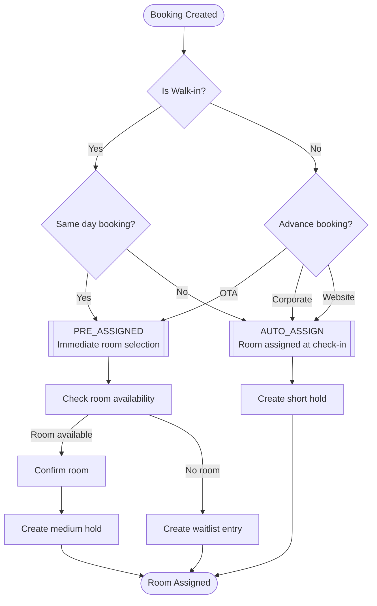
```mermaid
flowchart TD
    Start([Booking Created]) --> IsWalkin{Is Walk-in?}
    
    IsWalkin -->|Yes| SameDay{Same day booking?}
    IsWalkin -->|No| IsAdvance{Advance booking?}
    
    SameDay -->|Yes| PreAssign[[PRE_ASSIGNED<br/>Immediate room selection]]
    SameDay -->|No| AutoAssign[[AUTO_ASSIGN<br/>Room assigned at check-in]]
    
    IsAdvance -->|OTA| PreAssign
    IsAdvance -->|Corporate| AutoAssign
    IsAdvance -->|Website| AutoAssign
    
    PreAssign --> CheckAvailability[Check room availability]
    AutoAssign --> CreateHold[Create short hold]
    
    CheckAvailability --> |Room available| ConfirmPreAssign[Confirm room]
    CheckAvailability --> |No room| CreateWaitlist[Create waitlist entry]
    
    ConfirmPreAssign --> CreateMediumHold[Create medium hold]
    
    CreateMediumHold --> End([Room Assigned])
    CreateHold --> End
    CreateWaitlist --> End
```

---

## 7. OTA Sync Mechanisms

### 7.1 Sync Architecture

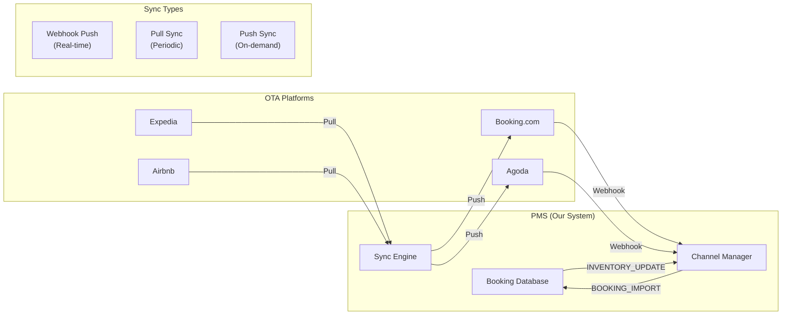
```mermaid
flowchart LR
    subgraph PMS["PMS (Our System)"]
        BookingDB[Booking Database]
        ChannelManager[Channel Manager]
        SyncEngine[Sync Engine]
    end
    
    subgraph OTA["OTA Platforms"]
        BookingCom[Booking.com]
        Agoda[Agoda]
        Expedia[Expedia]
        Airbnb[Airbnb]
    end
    
    subgraph SyncTypes["Sync Types"]
        Webhook["Webhook Push<br/>(Real-time)"]
        Pull["Pull Sync<br/>(Periodic)"]
        Push["Push Sync<br/>(On-demand)"]
    end
    
    ChannelManager -->|BOOKING_IMPORT| BookingDB
    BookingDB -->|INVENTORY_UPDATE| ChannelManager
    
    BookingCom -->|Webhook| ChannelManager
    Agoda -->|Webhook| ChannelManager
    Expedia -->|Pull| SyncEngine
    Airbnb -->|Pull| SyncEngine
    
    SyncEngine -->|Push| BookingCom
    SyncEngine -->|Push| Agoda
```

### 7.2 Sync Flow Types

| Sync Type | Direction | Trigger | Use Case |
|-----------|-----------|---------|----------|
| Booking Import | OTA → PMS | Webhook or Pull | New OTA bookings |
| Booking Update | OTA → PMS | Webhook or Pull | Modifications |
| Booking Cancel | OTA → PMS | Webhook | Cancellations |
| Inventory Push | PMS → OTA | On-change or Periodic | Availability updates |
| Rate Push | PMS → OTA | On-change or Periodic | Rate updates |
| Booking Confirm | PMS → OTA | On-create | Confirm booking received |

### 7.3 Conflict Resolution

```typescript
enum ConflictStrategy {
  PMS_WINS = 'PMS_WINS',       // PMS data takes precedence
  OTA_WINS = 'OTA_WINS',       // OTA data takes precedence
  NEWEST_WINS = 'NEWEST_WINS', // Most recent update wins
  MANUAL = 'MANUAL'            // Requires manual resolution
}

interface ConflictResolution {
  conflictType: 'DATE_MISMATCH' | 'ROOM_MISMATCH' | 'GUEST_MISMATCH' | 'PRICE_MISMATCH';
  pmsValue: any;
  otaValue: any;
  resolution: ConflictStrategy;
  resolvedAt?: Date;
  resolvedBy?: string;
}
```

---

## 8. Waitlist Handling

### 8.1 Waitlist Lifecycle

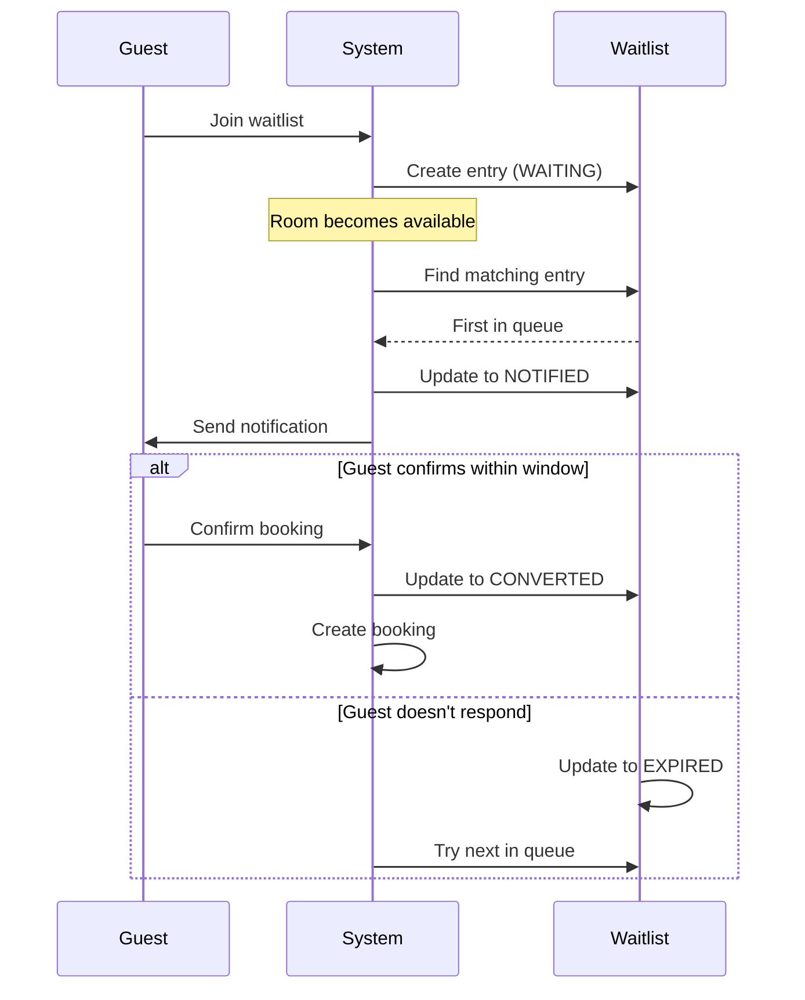
```mermaid
sequenceDiagram
    participant Guest
    participant System
    participant Waitlist
    
    Guest->>System: Join waitlist
    System->>Waitlist: Create entry (WAITING)
    
    Note over System: Room becomes available
    System->>Waitlist: Find matching entry
    Waitlist-->>System: First in queue
    
    System->>Waitlist: Update to NOTIFIED
    System->>Guest: Send notification
    
    alt Guest confirms within window
        Guest->>System: Confirm booking
        System->>Waitlist: Update to CONVERTED
        System->>System: Create booking
    else Guest doesn't respond
        Waitlist->>Waitlist: Update to EXPIRED
        System->>Waitlist: Try next in queue
    end
```

### 8.2 Waitlist Priority Rules

1. **Priority level** (higher = more priority)
2. **Creation time** (earlier = more priority within same level)
3. **Room type match** (exact match preferred)
4. **Date range match** (exact match preferred)

### 8.3 Waitlist Expiry Rules

- Default expiry: 24 hours after creation
- Notified expiry: 30 minutes after notification
- Can be extended by staff

---

## 9. Duplicate Detection Logic

### 9.1 Detection Criteria

| Match Type | Confidence | Action |
|-----------|------------|--------|
| Exact phone + overlapping dates | 100% | BLOCK |
| Exact email + overlapping dates | 100% | BLOCK |
| Exact room + overlapping dates | 90% | WARN |
| Fuzzy name + fuzzy phone | 60% | WARN |
| Same guest ID | 100% | BLOCK |

### 9.2 Detection Window

- Default: 24 hours before check-in to 24 hours after check-out
- Configurable via `duplicateCheckWindowHours` in HotelSettings

### 9.3 Resolution Options

1. **KEPT_PRIMARY** - Keep original booking, cancel new one
2. **MERGED** - Merge guest details if same person
3. **BOTH_KEPT** - Allow both (different rooms)

---

## 10. Implementation Phases

### Phase 1: Core Booking (Weeks 1-2)
- [ ] Walk-in booking with instant room allocation
- [ ] Basic check-in/check-out
- [ ] Room status management

### Phase 2: Advanced Booking (Weeks 3-4)
- [ ] Advance booking with partial payment
- [ ] Corporate/credit booking
- [ ] OTA webhook handlers

### Phase 3: Group & Split (Weeks 5-6)
- [ ] Group booking creation
- [ ] Split group into room types
- [ ] Bulk check-in/check-out

### Phase 4: Edge Cases (Weeks 7-8)
- [ ] Waitlist management
- [ ] Duplicate detection
- [ ] Early check-in handling
- [ ] Late arrival handling

### Phase 5: Room Assignment (Weeks 9-10)
- [ ] Pre-assign vs auto-assign logic
- [ ] Room change before check-in
- [ ] Room hold management

---

## Appendix A: API Response Formats

### Success Response
```json
{
  "success": true,
  "data": { ... },
  "meta": {
    "timestamp": "2026-06-15T14:00:00Z"
  }
}
```

### Error Response
```json
{
  "success": false,
  "error": {
    "code": "NO_ROOM_AVAILABLE",
    "message": "No rooms available for the selected dates",
    "details": { ... }
  }
}
```

### Paginated Response
```json
{
  "success": true,
  "data": [ ... ],
  "pagination": {
    "page": 1,
    "perPage": 20,
    "total": 100,
    "pages": 5
  }
}
```

---

## Appendix B: Event Types

```typescript
enum BookingEventType {
  CREATED = 'booking.created',
  UPDATED = 'booking.updated',
  CHECKED_IN = 'booking.checked_in',
  CHECKED_OUT = 'booking.checked_out',
  CANCELLED = 'booking.cancelled',
  NO_SHOW = 'booking.no_show',
  ROOM_CHANGED = 'booking.room_changed',
  PAYMENT_RECEIVED = 'booking.payment_received',
  EXTENDED = 'booking.extended',
  SHORTENED = 'booking.shortened',
}
```

---

## Appendix C: Mermaid Diagrams

### Booking State Machine
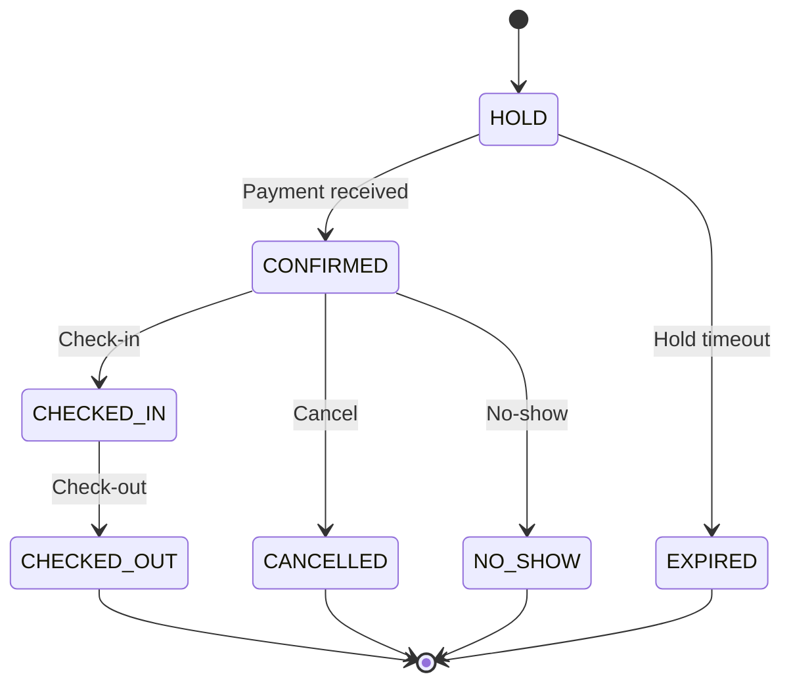
```mermaid
stateDiagram-v2
  [*] --> HOLD
  HOLD --> CONFIRMED : Payment received
  HOLD --> EXPIRED : Hold timeout
  CONFIRMED --> CHECKED_IN : Check-in
  CONFIRMED --> CANCELLED : Cancel
  CONFIRMED --> NO_SHOW : No-show
  CHECKED_IN --> CHECKED_OUT : Check-out
  CHECKED_OUT --> [*]
  CANCELLED --> [*]
  NO_SHOW --> [*]
  EXPIRED --> [*]
```

### Room Assignment Flow
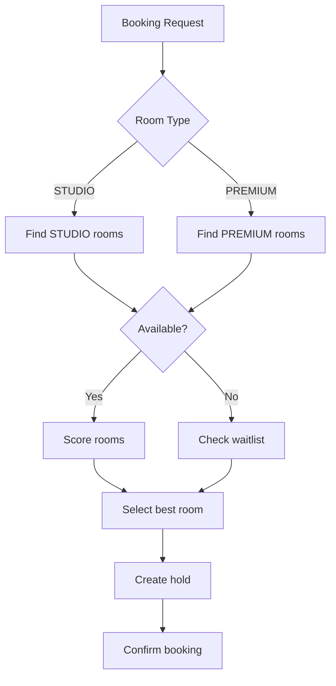
```mermaid
flowchart TD
    A[Booking Request] --> B{Room Type}
    B -->|STUDIO| C[Find STUDIO rooms]
    B -->|PREMIUM| D[Find PREMIUM rooms]
    C --> E{Available?}
    D --> E
    E -->|Yes| F[Score rooms]
    E -->|No| G[Check waitlist]
    F --> H[Select best room]
    G --> H
    H --> I[Create hold]
    I --> J[Confirm booking]
```

---

*Document Version: 1.0*  
*Last Updated: 2026-06-15*  
*Status: Ready for Review*
